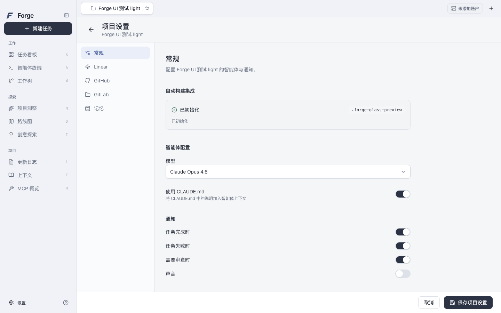

<div align="center">


# Forge

### From an idea to a delivery you can verify.

Task contracts · Agent roles · Code snapshots · Human acceptance

[](https://github.com/j-tide/Forge/releases/tag/v0.1.0-preview.4) [](python/) [](https://github.com/j-tide/Forge/actions/workflows/desktop-quality.yml) [](desktop/LICENSE)

[**Highlights**](#highlights) · [Architecture](#system-architecture) · [Data flow](#from-requirements-to-delivery-how-data-flows) · [Desktop preview](#desktop-preview) · [Get started](#get-started)

[简体中文](README.md) / **English**

</div>

Forge is an open-source AI coding workspace built around **reviewable delivery**. Natural language becomes an editable task contract, followed by planning, development, review, and verification. The complete workflow connects run configuration, context, code snapshots, and check results. **You decide when to approve a task, start execution, accept the result, and merge the code.**

> **Current status:** Forge consists of an independent **Python Core** and **Desktop**. The delivery workflow below has Core implementations and verification records tied to specific builds of the original Forge desktop. The currently released derivative in `desktop/` is being integrated and **is not yet connected to the Python Host**. [See verification scope](#project-status).

## System architecture

**The interface handles interaction, Core owns state, and plugins provide execution capabilities.** Forge separates the task lifecycle from individual models, executors, and desktop interfaces, so approvals, permissions, and evidence follow one set of rules.

<picture>
  <source media="(prefers-color-scheme: dark)" srcset="docs/assets/readme/architecture.en.dark.svg" />
  
</picture>

[View the full-size architecture diagram](docs/assets/readme/architecture.en.light.svg) · [Diagram source](docs/assets/readme/architecture.en.json)

The diagram distinguishes the original Forge desktop's existing runtime path from the derivative desktop's pending integration. The Python Host boundary is defined in [ADR 0029](docs/decisions/0029-python-core-runtime-architecture.md); the desktop integration direction is documented in [ADR 0087](docs/decisions/0087-aperant-derived-desktop-base.md).

| Layer | Responsibilities | Key boundary |
| --- | --- | --- |
| **Desktop / Client** | Projects, boards, task details, configuration, and evidence views. | In the final integration, the Renderer accesses the Host through a restricted bridge; Main handles system integration and the Host lifecycle. |
| **Python Host / Core** | Task contracts, approvals, workflows, Run scheduling, context, review, verification, and delivery. | Owns business state and communicates with the desktop through versioned JSON-RPC over stdio. |
| **Plugins / Executors** | Model, executor, and controlled tool integrations. | Register capabilities through the public Python API; plugins cannot directly change Core state or create valid human approvals. |
| **Persistence / Workspace** | SQLite state, Git worktrees, code snapshots, reports, and delivery records. | Preserves versions and provenance; each workspace allows only one writer. |

## Highlights

### 01 · Define the task before agents start coding

Forge turns natural language into a **Task Contract**: the goal, acceptance criteria, allowed changes, explicit exclusions, and open questions. You can edit and revise the contract before approving a specific version.

Approval is bound to the task revision and scope hash. An approved task enters the backlog; starting it is a separate action. When requirements change, an old approval cannot silently authorize the new task.

### 02 · Give planning, development, review, and verification distinct jobs

The **Planner** produces a structured plan. The **Developer** changes code in an isolated worktree. The **Reviewer** performs an independent, read-only review of a fixed snapshot. The **Verifier** runs approved project check commands.

Planner, Developer, and Reviewer have their own Profiles, models, and capability requirements. A Workflow defines stage order and gates. Review findings and failed checks can produce rework handoffs that retain their source, subject to limits on rounds, attempts, and run budgets.

### 03 · Trace every acceptance criterion to its evidence

Development output is captured as a **CodeSnapshot**. Review, Verify, and individual acceptance decisions are linked to the same task revision and code snapshot. The acceptance matrix distinguishes verified requirements, failures, pending manual checks, unverified items, and explicitly accepted risks.

The final delivery record links runs, plans, code snapshots, review and verification reports, and the human acceptance decision. Those references lead back to the configuration and code diff. When the code or acceptance basis changes, earlier conclusions cannot advance the new version.

### 04 · Isolate changes and make stopping a real operation

Development uses a separate **Git worktree** and a fixed baseline. A workspace lease ensures a single writer. When a run is cancelled, the Host waits for its owned processes to exit before releasing the lease. Interruptions whose outcome cannot be confirmed retain isolation, the diff, and diagnostic records.

Where changes happen, who is writing, and whether execution has actually stopped are all part of system state. Marking a task **Done** still leaves merging as a separate decision.

### 05 · Evolve workflows without changing runs already in progress

Published Workflows, Agent Profiles, plugin versions, models, and budgets are fixed in **RunConfig**. Later configuration changes do not rewrite existing runs; historical tasks retain the workflow and parameters they used.

Core currently supports validated `quick`, `standard`, and `strict` linear workflows. The workflow canvas and configuration describe the process; Core decides whether it is valid to execute.

### 06 · Keep project memory traceable and correctable

Project knowledge retains source locations, versions, and hashes. Memories begin as candidates and require human confirmation before entering context. Content is scoped by project and environment, with support for conflict handling, expiry, replacement, and revocation.

The sources used by a run are frozen, and their validity can be inspected later. Project experience can guide execution; the approved task contract remains the basis for acceptance.

## From requirements to delivery: how data flows

The diagram below shows the **Python Core task and evidence chain**. Each stage receives inputs with explicit provenance and produces persistent records. It does not imply that the current desktop preview is connected to the entire chain.

<picture>
  <source media="(prefers-color-scheme: dark)" srcset="docs/assets/readme/task-flow.en.dark.svg" />
  
</picture>

[View the full-size data flow diagram](docs/assets/readme/task-flow.en.light.svg) · [Diagram source](docs/assets/readme/task-flow.en.json)

### Five records that connect the whole process

| Record | What it preserves | The question it answers |
| --- | --- | --- |
| **Task Contract** | Goal, scope, acceptance criteria, revision, and approval basis. | What exactly does this task need to accomplish? |
| **RunConfig + ContextBundle** | Workflow, roles, models, budgets, command presets, and knowledge sources. | Which rules and references did the agent use? |
| **CodeSnapshot** | A fixed code revision and diff from a development attempt. | Which code revision does this review or check cover? |
| **Review / Verify / Acceptance** | Review findings, actual command results, and individual acceptance decisions. | What supports acceptance, and what remains unverified? |
| **Delivery Record** | The accepted snapshot, linked reports, risks, and human decision. | What was delivered, who accepted it, and on what basis? |

**Rework starts a new run; successful development produces a new snapshot.** The system retains failure reasons and original evidence. New code needs corresponding checks and cannot inherit a previous version's passing result. When a limit is reached, the workflow stops and records why intervention is needed.

### An example: add CSV export to an orders page

This is a **simplified illustration of task contract fields**, showing how a request becomes a checkable goal. It is not a complete import file, and it does not represent an executed example.

```yaml
title: Add CSV export to the orders page
goal: Let users export orders matching the current filters
scope:
  - Order list page and export service
  - Related automated tests
outOfScope:
  - Changes to the order database schema
  - Changes to interactions on other pages
acceptance:
  - id: AC-1
    statement: Exported results match the current filters
    method: automated
    required: true
  - id: AC-2
    statement: Chinese text, commas, and multiline fields are correctly escaped
    method: automated
    required: true
  - id: AC-3
    statement: Empty results and export failures provide clear feedback
    method: manual
    required: true
```

The Planner works within the approved scope; the Developer implements the change; the Reviewer inspects the code snapshot; the Verifier runs approved checks. You can inspect the evidence for AC-1 through AC-3 and accept the result or return it for rework. **Accepting delivery, merging code, and releasing an application are three separate decisions.**

## Agent responsibilities and workflows

### Clear responsibilities and explicit handoffs

| Role / service | Input | Output and permissions |
| --- | --- | --- |
| **Refiner · Requirements** | User messages and permitted project context. | Editable contracts and clarification questions; does not directly start development. |
| **Planner · Planning** | Approved contract, fixed Git baseline, and stage context. | A versioned Plan Artifact with provenance; read-only planning. |
| **Developer · Implementation** | Contract, plus a plan or rework feedback where applicable. | Code changes in an isolated worktree and a development handoff. |
| **Reviewer · Review** | Fixed snapshot, diff, and independent review context. | Structured findings and review conclusions from a read-only copy. |
| **Verifier · Project check service** | Fixed snapshot and approved command presets. | Command exit status and reports; this is a service that executes checks, not a model's claim of success. |
| **Owner · Human** | Task, plan, or delivery evidence. | Approval, start, return for rework, risk decisions, and final acceptance. |

### Three workflows with explicit acceptance gates

| Workflow | Stages | Suitable tasks |
| --- | --- | --- |
| **Quick** | Develop → Review → Verify → Human acceptance | Small, clearly scoped changes that do not need a separate planning stage. |
| **Standard** | Plan → Develop → Review → Verify → Human acceptance | Features and refactors that benefit from an implementation plan. |
| **Strict** | Plan → **Human plan approval** → Develop → Review → Verify → Human acceptance | Tasks whose implementation plan should be approved before code changes begin. |

Stage order defines handoffs; progression is governed by Host gates. Standard automatically continues to the Developer after a successful plan; Strict waits for plan approval first. The first Review and Verify checks still require explicit actions. After rework, the controlled rework chain triggers the relevant follow-up checks. Final acceptance always belongs to a person.

The original Forge installation has evidence of a complete Standard path using real Codex execution. The complete Strict path remains unverified. See the [workflow presets](python/src/forge/workflow_presets/) and the runtime boundaries in [ADR 0067](docs/decisions/0067-published-linear-workflow-runtime-and-retrieval-freeze.md).

## Desktop preview

The current desktop organizes tasks, model configuration, terminals, and worktrees around each project. Silver light and graphite dark themes share a compact layout, with Chinese / English, keyboard operation, reduced motion, and reduced transparency support.

### Describe a requirement and configure a task

<picture>
  <source media="(prefers-color-scheme: dark)" srcset="desktop/docs/screenshots/0.1.0-preview.4/new-task-dark-1440.png" />
  
</picture>

### Manage projects and preferences in one workspace

| Project settings | English / dark interface |
| --- | --- |
|  |  |

These are real Electron screenshots from `0.1.0-preview.4`. Projects and tasks use isolated UI test data; no online agents were run during capture. [Screenshot provenance and checksums](desktop/docs/screenshots/0.1.0-preview.4/screenshots.json).

## Get started

### Download the desktop preview

The current version is **0.1.0-preview.4**, with packages for **macOS Apple Silicon (M-series chips)**.

| Download | Purpose |
| --- | --- |
| [**macOS DMG**](https://github.com/j-tide/Forge/releases/download/v0.1.0-preview.4/Forge-0.1.0-preview.4-darwin-arm64-INTERNAL.dmg) | Open it and drag `Forge.app` into Applications. |
| [macOS ZIP](https://github.com/j-tide/Forge/releases/download/v0.1.0-preview.4/Forge-0.1.0-preview.4-darwin-arm64-INTERNAL.zip) | Extract it and open `Forge.app`. |
| [Corresponding source](https://github.com/j-tide/Forge/releases/download/v0.1.0-preview.4/Forge-0.1.0-preview.4-source.tar.gz) | Complete source corresponding to the release tag. |
| [SHA256SUMS](https://github.com/j-tide/Forge/releases/download/v0.1.0-preview.4/SHA256SUMS) | Verify download checksums. |

These are **INTERNAL / ADHOC / UNNOTARIZED** prerelease packages, signed ad hoc without Developer ID signing or notarization. Verify the download checksum, quit the older version normally, and open the new version from Finder. Follow macOS security prompts; there is no need to disable Gatekeeper globally.

### Your first session

1. **Open a project:** Select a local Git directory and follow the initialization prompts. Use a test repository for your first session.
2. **Configure models:** Add your own credentials under Settings → Accounts and choose stage models in Agent Settings. Configure executable paths where a CLI is required.
3. **Create a task:** Describe the goal, reference files or attach images, then check the base branch, worktree, review, and push options before saving.
4. **Start explicitly:** Click Start on the board after creating the task. Inspect activity through task details, terminals, and worktrees. The current preview's complete online workflow remains unverified.

Project features require **Git**. Model calls require valid authentication and network access; some executors also require their CLI. See the [desktop documentation](desktop/README.md) for more entry points and data directory details.

## Project status

| Area | Implementations and evidence | Current boundary |
| --- | --- | --- |
| **Python Core delivery workflow** | Task contracts, role separation, isolated execution, snapshot review, command verification, human acceptance, and delivery records. The original Forge macOS arm64 installation has a real Codex Standard workflow record. | Evidence belongs to the corresponding historical builds; it neither establishes integration in the current derivative preview nor proves every acceptance case. |
| **Current derivative Desktop** | Light and dark interfaces, local task persistence, project settings, keyboard operation, preference restoration after restart, DMG launch, and package consistency checks. | Not yet connected to the Forge Python Host; the complete online task workflow remains unverified. |
| **Executors and extensions** | Real Codex execution, public Python plugin API, and capability and permission checks. | The complete Claude path, external MCP servers, and third-party integrations still require their respective acceptance checks. |
| **Distribution and platforms** | Internal macOS Apple Silicon preview; Linux CI covers static checks, unit tests, and builds. | Windows and Intel Mac hardware, production signing, notarization, and signed updates remain unverified. |
| **Mobile and remote access** | Existing code and historical records are retained. | New development is deferred; remote network entry points are disabled by default. |

The next priorities are **connecting the new desktop to Core, verifying desktop features individually, and validating the delivery workflow in the installed app**. Known dependency audit risks are documented in the [release notes](desktop/docs/releases/0.1.0-preview.4.md#未关闭风险); progress and evidence tied to specific versions are in the [implementation record](docs/implementation-status.md).

## Local development

### Desktop · Electron + React + TypeScript

Prerequisites: **Node.js 24+, npm 10+, and Git**. Native builds on macOS require Xcode Command Line Tools.

```sh
git clone https://github.com/j-tide/Forge.git
cd Forge/desktop

npm ci --ignore-scripts
node node_modules/electron/install.js
npm --workspace apps/desktop run postinstall
npm run dev
```

Run checks and build from `desktop/`:

```sh
npm run check:i18n
npm run lint
npm run typecheck
npm test
npm run build
```

After changing UI interactions, run the real Electron regression checks on macOS. They use isolated data and do not call online models:

```sh
npm run test:ui:desktop
npm run test:overlays:desktop
npm run test:files:desktop
npm run test:i18n:desktop
```

### Core · Python + asyncio + Pydantic + SQLite

Python uses **3.12+** and uv. The separate pnpm project at the repository root requires **Node.js `>=22.13.0 <23` and pnpm `12.3.4`**, with different Node requirements and lockfiles from `desktop/`. Switch to the appropriate environment, then run from the repository root:

```sh
pnpm install --frozen-lockfile
pnpm py:check          # Sync dependencies; run Ruff, mypy, and pytest
pnpm dev:python-host   # Start the standalone stdio Host
```

Host standard output is reserved for protocol communication. Starting the Host separately does not connect the derivative desktop automatically. Tool versions are recorded in [versions.lock.json](versions.lock.json).

### Repository layout

```text
Forge/
├── desktop/              # Current derivative desktop; separate npm workspace
├── python/src/forge/     # Core: tasks, workflows, execution, context, evidence, plugins
├── python/tests/         # Python Core tests
├── apps/                 # Original Forge desktop / Vue UI; old Node Host reference
├── packages/             # Public contracts, client, shared UI, and validators
├── plugins/              # Original TypeScript plugins retained as migration references
├── tests/                # Integration tests and acceptance fixtures
└── docs/                 # Architecture decisions, diagrams, progress, and evidence
```

## Further reading and contributing

| To learn about | Start here |
| --- | --- |
| How task contracts are defined | [Task Contract model](python/src/forge/drafts.py) · [Approval and the backlog](docs/decisions/0014-task-approval-and-atomic-todo.md) |
| How a run stays consistent | [RunConfig](python/src/forge/run_config.py) · [Published workflows and frozen context](docs/decisions/0067-published-linear-workflow-runtime-and-retrieval-freeze.md) |
| How delivery decisions are formed | [Acceptance matrix](python/src/forge/acceptance_matrix.py) · [Final human acceptance](docs/decisions/0042-snapshot-bound-final-human-acceptance.md) |
| How capabilities are extended | [Plugin authoring](docs/plugin-authoring.md) · [Public Python API](python/src/forge/plugin_api.py) |
| How to run and build the desktop | [Desktop documentation](desktop/README.md) · [Packaging guide](desktop/RELEASE.md) |
| What has been verified | [Release notes](desktop/docs/releases/0.1.0-preview.4.md) · [Implementation record](docs/implementation-status.md) |

Documentation, translation, UI, and Core contributions are welcome. Open an [issue](https://github.com/j-tide/Forge/issues) with a use case or reproducible problem. Keep each PR focused on one improvement, include actual verification results, and add screenshots for UI changes. Remove credentials and personal information from logs and screenshots.

Read [AGENTS.md](AGENTS.md) before making changes. Discuss changes to architecture, permissions, or product state first. Run the appropriate checks for the desktop and root projects, and preserve user data, copyright notices, and source attribution.

## Acknowledgments and licensing

The current desktop is derived from [Aperant](https://github.com/AndyMik90/Aperant) **`v2.8.0-beta.6`** under [GNU AGPL-3.0](desktop/LICENSE). Thanks to AndyMik90 and the upstream contributors. Original copyright notices, licenses, and source attribution are retained; Forge is maintained independently.

See [UPSTREAM.md](desktop/UPSTREAM.md) for the imported version, original commits, and modification history. Releases provide the complete corresponding source. Licensing boundaries for other directories follow their respective notices and [ADR 0087](docs/decisions/0087-aperant-derived-desktop-base.md).
