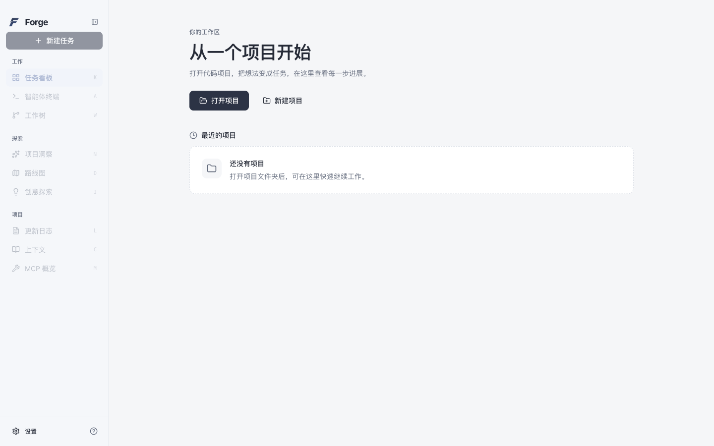
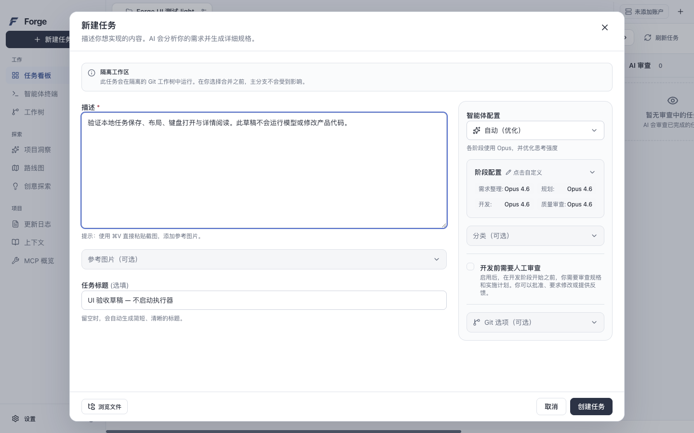
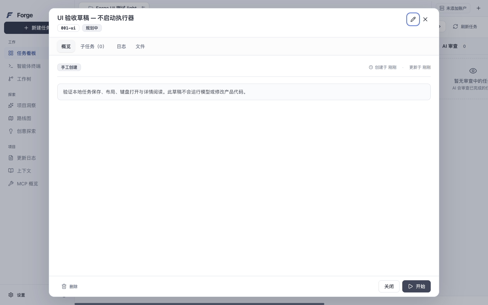

<div align="center">
  
  <h1>Forge</h1>
  <p><strong>From an idea to a development process you can follow.</strong></p>
  <p>Task board · Models by phase · Code review · Integrated terminals</p>
  <p>
    <a href="https://github.com/j-tide/Forge/releases/tag/v0.1.0-preview.6">Download preview</a> ·
    <a href="docs/user-guide.md">User guide (Chinese)</a> ·
    <a href="docs/development.md">Development docs (Chinese)</a> ·
    <a href="README.md">简体中文</a>
  </p>
</div>

Forge is an AI development desktop app for code projects. Open a Git repository, describe the work, choose models for each phase, and follow tasks on a board. Read execution logs and review code changes alongside your projects, terminals, and development tools.

| Silver light | Graphite dark |
| --- | --- |
|  |  |

## What you can do

- **Turn requirements into tasks.** Describe a goal, attach reference images, or mention project files with `@`. Keep unfinished descriptions as drafts.
- **Choose models by phase.** Configure models and thinking levels for specification, planning, coding, and quality review. Account settings include explicit connection tests to help identify authentication or connection problems before starting.
- **Follow work on a task board.** Track planning, queued work, development, AI review, human review, and completion. Creating a task and starting it are separate actions.
- **Review changes beside the task.** Inspect subtasks, logs, files, and code diffs; leave feedback and use the Git action controls to handle changes.
- **Keep development tools close.** Use integrated terminals and inspect Git worktrees. Project settings and application settings manage project configuration and global preferences separately.
- **Explore the project.** Open Insights, Ideation, Roadmap, Changelog, and Context. MCP overview and local memory management are also available in the workspace.
- **Make the workspace comfortable.** Switch themes and languages, adjust fonts, or reduce motion and transparency. Preferences persist once saved; language changes save immediately.

| Describe work and configure phases | Inspect task details |
| --- | --- |
|  |  |

Screenshots show the actual preview.6 app with local example tasks. [Screenshot provenance](docs/screenshots/0.1.0-preview.6/screenshots.json).

## Download and install

The current version is **[0.1.0-preview.6](https://github.com/j-tide/Forge/releases/tag/v0.1.0-preview.6)**, with installation packages for **macOS Apple Silicon (M-series chips)**.

**[Download DMG](https://github.com/j-tide/Forge/releases/download/v0.1.0-preview.6/Forge-0.1.0-preview.6-darwin-arm64-INTERNAL.dmg)** · [Download ZIP](https://github.com/j-tide/Forge/releases/download/v0.1.0-preview.6/Forge-0.1.0-preview.6-darwin-arm64-INTERNAL.zip) · [Checksums](https://github.com/j-tide/Forge/releases/download/v0.1.0-preview.6/SHA256SUMS)

Open the DMG and drag `Forge.app` into Applications, or extract the ZIP and open the app. Save your work and quit the existing instance before upgrading.

This internal preview is not notarized; follow macOS security prompts. Complete online workflows and additional platforms are still being verified. See the [current release's known limitations](docs/releases/0.1.0-preview.6.md#未关闭风险) before use.

## Start your first task

1. **Open a project.** Click **Open Project** and select a Git repository with at least one commit. Follow the prompts to initialize its Forge project data.
2. **Connect a model provider.** Open **Settings → Accounts**, configure and save the required authentication, then use the available test controls. Choose phase models in **Agent Settings**.
3. **Describe the goal.** Click **New Task**, enter requirements, add images or file references if needed, and check phase models, the base branch, and review options before creating the task.
4. **Start and follow the work.** Click **Start** on the task card or in its details. Follow subtasks, logs, and files; inspect code diffs and leave feedback during human review.

Model calls use your own provider accounts and may incur charges. Connection tests cover different checks depending on the provider; a successful connection does not prove complete task execution. See the [user guide (Chinese)](docs/user-guide.md) for setup details and common questions.

## Run from source

Forge uses **Electron + React + TypeScript** in a single npm project. You need **Node.js 24+, npm 10+, and Git**. Native builds on macOS need Xcode Command Line Tools.

```sh
git clone https://github.com/j-tide/Forge.git
cd Forge
npm ci --ignore-scripts
node node_modules/electron/install.js
npm run postinstall
npm run dev
```

Source is organized by runtime responsibility:

```text
src/main/       Application services, Agents, Git, and terminals
src/preload/    Desktop API bridge
src/renderer/   React interface
src/shared/     Types, localization, and shared logic
resources/      Icons and platform assets
prompts/        Runtime prompts
scripts/        Build, launch, and check tools
tests/          Tooling, UI, and end-to-end checks
docs/           Usage, development, and release documentation
```

[Development setup and checks (Chinese)](docs/development.md) · [Contributing](CONTRIBUTING.md) · [Report an issue](https://github.com/j-tide/Forge/issues)

## Documentation and license

- [User guide (Chinese)](docs/user-guide.md): account setup, task actions, and common questions.
- [Development docs (Chinese)](docs/development.md): source entry points, runtime structure, and local checks.
- [Release notes (Chinese)](docs/releases/0.1.0-preview.6.md): changes, verification results, and known limitations.
- [Implementation status (Chinese)](docs/implementation-status.md): current progress and remaining work.

Forge is derived from [Aperant](https://github.com/AndyMik90/Aperant) `v2.8.0-beta.6` and released under [AGPL-3.0](LICENSE). Thanks to the upstream authors and contributors. Original copyright, provenance, and modification records are preserved in [UPSTREAM.md](UPSTREAM.md). The release includes [complete source corresponding to the installation packages](https://github.com/j-tide/Forge/releases/download/v0.1.0-preview.6/Forge-0.1.0-preview.6-source.tar.gz).
