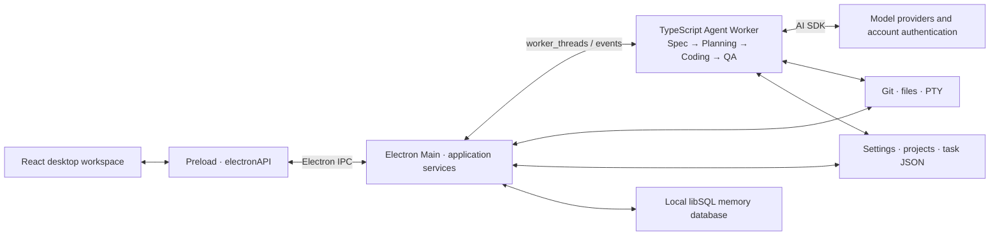
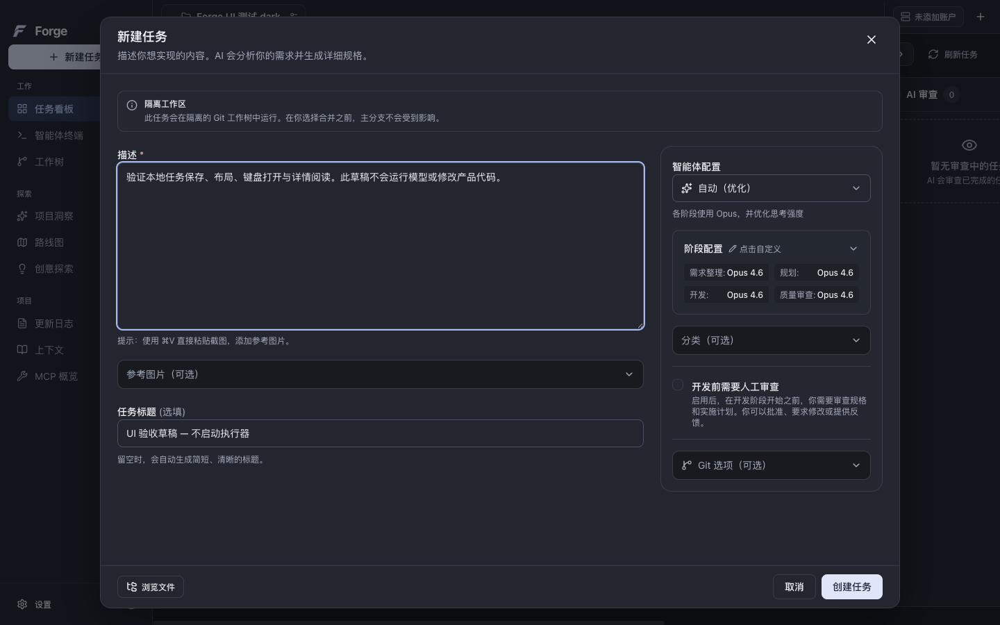

# Forge


**An AI desktop workspace for organizing coding tasks, configuring models, and following development activity.**

[简体中文](README.md) / **English**

The application and development workspace live in [`desktop/`](desktop/README.md), built with **Electron + React + TypeScript** and an independent npm workspace.

## Current release

[**0.1.0-preview.5 · macOS Apple Silicon**](https://github.com/j-tide/Forge/releases/tag/v0.1.0-preview.5) is an **INTERNAL / ADHOC / UNNOTARIZED** prerelease focused on model tests, task actions, and failure recovery.

| Download | Purpose |
| --- | --- |
| [DMG](https://github.com/j-tide/Forge/releases/download/v0.1.0-preview.5/Forge-0.1.0-preview.5-darwin-arm64-INTERNAL.dmg) | Open it and drag `Forge.app` into Applications. |
| [ZIP](https://github.com/j-tide/Forge/releases/download/v0.1.0-preview.5/Forge-0.1.0-preview.5-darwin-arm64-INTERNAL.zip) | Extract and open the application. |
| [Corresponding source](https://github.com/j-tide/Forge/releases/download/v0.1.0-preview.5/Forge-0.1.0-preview.5-source.tar.gz) | Complete source matching the release tag. |
| [SHA256SUMS](https://github.com/j-tide/Forge/releases/download/v0.1.0-preview.5/SHA256SUMS) | Verify the downloaded files. |

Save your work and quit any running Forge instance before installing. This build is not notarized; follow macOS security prompts.

## Features

| Feature | Entry point |
| --- | --- |
| Projects and tasks | Open a code directory, create tasks on the board, and inspect subtasks, logs, files, and review results; start execution separately after creation. |
| Models and accounts | Configure providers and phase models in application settings, explicitly test connections, and retry with visible errors. |
| Project settings | Use the configuration button beside the project tab for the current project, and application settings for global preferences. |
| Development workspace | Inspect Git branches, worktrees, and file changes; use the integrated terminal and task execution/push options. |
| Project tools | Access Insights, Ideas, Roadmap, Context, Memory, and MCP configuration. |
| Appearance and language | Silver light and graphite dark themes, Chinese/English, reduced transparency and motion; preferences survive restart. |

Model calls require valid provider credentials, network access, and authorization for applicable costs. Current verification covers local UI, persistence, and installation packages; **complete online Agent workflows, external OAuth, every model and tool, Windows, and macOS Intel still require verification**. The active Agent worker is not yet wired to the project `.env`/MCP override configuration chain; the presence of a settings page does not prove that execution path is active.

## Runtime architecture



Main registers project, task, terminal, and settings IPC. Agent Workers orchestrate model sessions, use built-in tools and MCP, and return logs and state events. Task files live in the project’s `.forge-glass-preview/`; settings and local memory use the isolated `Forge Glass Preview` user-data directory. Tasks can use Git worktrees; the current implementation falls back to the project directory if creation fails.

## Interface

| Light | Dark |
| --- | --- |
|  |  |
|  |  |

These screenshots come from the actual `.5` Electron build using isolated test projects, with no online Agent execution. [Provenance and checksums](desktop/docs/screenshots/0.1.0-preview.5/screenshots.json).

## Development

Use **Node.js 24+, npm 10+, and Git**. Native builds on macOS need Xcode Command Line Tools.

```sh
cd desktop
npm ci --ignore-scripts
node node_modules/electron/install.js
npm --workspace apps/desktop run postinstall
npm run dev
```

```sh
npm run check:i18n
npm run lint
npm run typecheck
npm test
npm run build

# Check actual Electron local interactions on macOS
npm run test:ui:desktop
npm run test:overlays:desktop
npm run test:files:desktop
npm run test:i18n:desktop

# Open the current version after building an installation package
npm run preview:open
```

Run development and checks inside `desktop/` using its `package-lock.json`. UI tests use isolated data directories; type checks and unit tests do not replace actual online execution or target-platform acceptance.

## Documentation and provenance

[Usage](desktop/README.md) · [Implementation status](desktop/docs/implementation-status.md) · [Release verification](desktop/docs/releases/0.1.0-preview.5.md) · [Packaging and release](desktop/RELEASE.md)

Forge is derived from [Aperant](https://github.com/AndyMik90/Aperant) `v2.8.0-beta.6` under [AGPL-3.0](desktop/LICENSE). Original authorship, copyright, import provenance, and modification records are preserved in [UPSTREAM.md](desktop/UPSTREAM.md). Corresponding source is available with the release.
