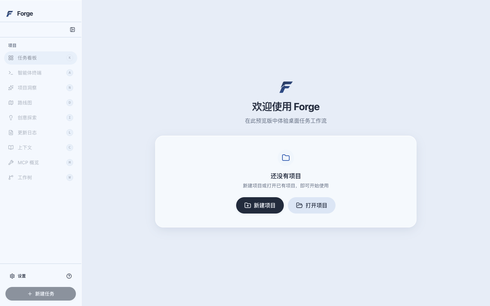
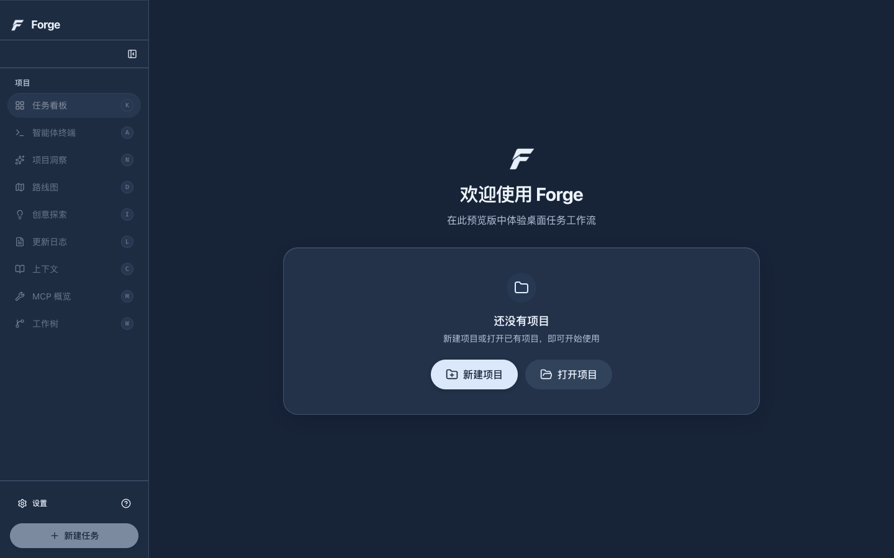
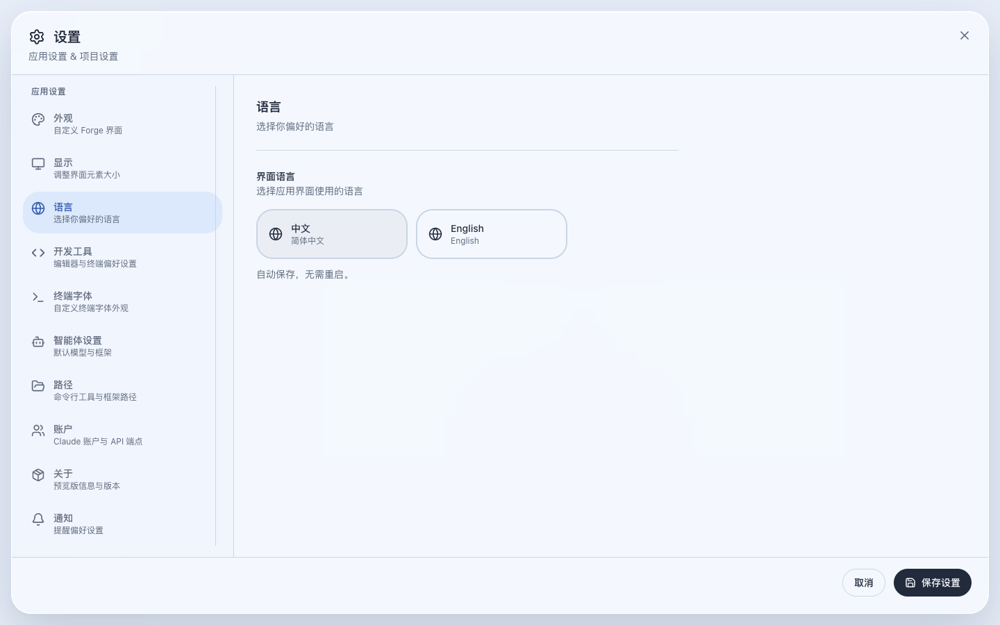

<div align="center">


# Forge

### 自然语言驱动的 AI 研发工作台

围绕本地代码项目，组织任务、配置 Agent 与模型、查看开发活动和代码变化。
中文与英文、亮色与暗色，让工作台适应你的习惯。

[](https://github.com/j-tide/Forge/releases/tag/v0.1.0-preview.3)
[](https://github.com/j-tide/Forge/actions/workflows/desktop-quality.yml)
[](https://github.com/j-tide/Forge/actions/workflows/quality.yml)
[](desktop/LICENSE)

[**下载 macOS 预览版**](https://github.com/j-tide/Forge/releases/tag/v0.1.0-preview.3) · [**从源码运行**](#从源码运行) · [**文档**](#文档)

</div>

<br />

<picture>
  <source media="(prefers-color-scheme: dark)" srcset="desktop/docs/screenshots/0.1.0-preview.3/home-dark-1440.png" />
  
</picture>

> 当前版本为 **0.1.0-preview.3**，提供 macOS Apple Silicon 预览包，尚未完成正式签名和公证。完整任务闭环与 Forge Python Host 集成尚未完成，其他平台仍待验证。

## 功能

| 功能 | 用途 |
| --- | --- |
| **项目与任务** | 打开本地项目，在看板中管理任务、查看执行信息。 |
| **Agent 与模型** | 配置模型提供方、认证和 Agent 选项。 |
| **终端与代码** | 查看命令活动、工作区和代码变化。 |
| **上下文与工具** | 配置项目上下文、集成和 MCP 工具。 |
| **中文 / English** | 在设置中即时切换语言，重启后保留选择。 |
| **亮色 / 暗色** | 银蓝磨砂界面，两种主题共用布局。 |

<details>
<summary><strong>查看暗色界面与语言设置</strong></summary>

<br />





</details>

## 下载与安装

1. 下载 [**macOS arm64 DMG**](https://github.com/j-tide/Forge/releases/download/v0.1.0-preview.3/Forge-0.1.0-preview.3-darwin-arm64-INTERNAL.dmg)。[Release](https://github.com/j-tide/Forge/releases/tag/v0.1.0-preview.3) 同时提供 ZIP、源码和 `SHA256SUMS`。
2. 核对校验摘要，打开 DMG，将 `Forge.app` 拖入 Applications。
3. 从 Finder 打开 Forge。若系统提示无法验证开发者，可在“系统设置 → 隐私与安全性”中确认打开。

### 首次使用

- 安装 **Git**，添加一个本地项目。建议先使用测试仓库熟悉操作。
- 在设置中配置模型提供方与认证；部分执行器需要额外安装 CLI，并保持所需网络连接。
- 选择中文或 English、亮色或暗色主题，再创建任务。

预览版使用独立的 `Forge Glass Preview` 用户数据目录和 `.forge-glass-preview/` 项目数据目录。服务凭据及执行器不随安装包提供。

## 从源码运行

**前置条件：Node.js 24+、npm 10+、Git。** 原生依赖需要本机编译工具；macOS 使用 Xcode Command Line Tools。

```sh
git clone https://github.com/j-tide/Forge.git
cd Forge/desktop

# 安装锁定依赖
npm ci --ignore-scripts

# 安装 Electron 并构建原生模块
node node_modules/electron/install.js
npm --workspace apps/desktop run postinstall

npm run dev
```

已有 macOS 应用包时，可在 `desktop/` 执行 `npm run preview:open` 打开。

### 工程检查

在 `desktop/` 中运行：

```sh
npm run check:i18n
npm run lint
npm run typecheck
npm run test
npm run build
```

macOS 上可追加 `npm run test:logo:desktop` 和 `npm run test:i18n:desktop`，检查主题、语言切换与重启保存。

桌面使用 **Electron + React + TypeScript**，位于 `desktop/`，采用独立 npm workspace。仓库内的 Python Host 和原 Vue/pnpm 工程分别维护，开发说明见下方文档。

## 文档

- [桌面开发与配置](desktop/README.md)
- [版本说明、验证结果与已知风险](desktop/docs/releases/0.1.0-preview.3.md)
- [兼容性记录](docs/compatibility-record.md)
- [产品规格](forge_spec_v1.0/START_HERE.md)

## 许可证与来源

桌面基于 Aperant `v2.8.0-beta.6`，采用 [AGPL-3.0](desktop/LICENSE)。来源、版权及修改记录见 [UPSTREAM.md](desktop/UPSTREAM.md)，Release 提供对应源码。
