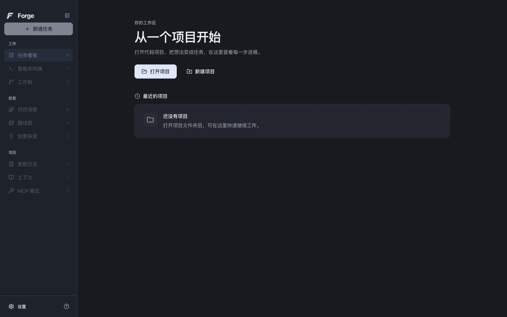
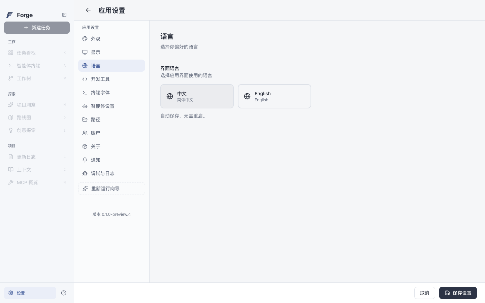

<div align="center">


# Forge

### 把项目、任务与 Agent 协作放进同一个工作台。

面向 AI 编程的桌面应用。围绕你的代码项目组织任务，
配置模型与 Agent，集中查看开发活动、终端和代码变化。

[](https://github.com/j-tide/Forge/releases/tag/v0.1.0-preview.4)
[](#下载安装)
[](https://github.com/j-tide/Forge/actions/workflows/desktop-quality.yml)
[](desktop/LICENSE)

[**下载 Forge**](#下载安装) · [**功能概览**](#功能概览) · [**快速上手**](#快速上手) · [**源码开发**](#源码开发)

</div>

<br />

<picture>
  <source media="(prefers-color-scheme: dark)" srcset="desktop/docs/screenshots/0.1.0-preview.4/home-dark-1440.png" />
  
</picture>

## 功能概览

### 项目与任务，集中管理

打开本地代码项目，用任务看板组织研发工作。创建任务时描述目标与限制，通过 `@` 引用项目文件、添加图片，并选择基准分支与工作树配置。

### Agent 与模型，按需配置

分别为需求整理、规划、开发和质量审查配置模型，在同一处管理模型服务、认证与 Agent 参数。结合项目上下文与工具配置，为任务准备所需的开发环境。

### 开发过程，随时查看

任务详情集中展示进度、子任务、日志与文件，配合智能体终端查看命令活动、检查代码变化。项目洞察、路线图与创意探索提供独立的项目分析入口。

### 熟悉的语言，舒适的界面

中文与 English 即时切换，银灰亮色与石墨暗色共用紧凑布局。磨砂集中于导航外壳，正文与表单使用清晰表面；支持减少动效与透明度。语言和主题偏好自动保留，代码、模型输出与用户内容保持原文。

**本版改进**：项目设置与应用设置分开；修复顶部弹层遮挡、中文文件引用、草稿配置丢失及跨项目迟到数据；保存失败保留输入，删除预检失败时阻止删除。

<details>
<summary><strong>查看暗色界面与语言设置</strong></summary>

<br />

**暗色工作台**



**中文 / English 切换**



</details>

## 下载安装

当前版本：**0.1.0-preview.4**，适用于 **Apple Silicon Mac（M 系列芯片）**。

| 下载 | 说明 |
| --- | --- |
| [**macOS DMG**](https://github.com/j-tide/Forge/releases/download/v0.1.0-preview.4/Forge-0.1.0-preview.4-darwin-arm64-INTERNAL.dmg) | 打开后将 `Forge.app` 拖入 Applications。 |
| [macOS ZIP](https://github.com/j-tide/Forge/releases/download/v0.1.0-preview.4/Forge-0.1.0-preview.4-darwin-arm64-INTERNAL.zip) | 解压后打开 `Forge.app`。 |
| [版本说明与校验文件](https://github.com/j-tide/Forge/releases/tag/v0.1.0-preview.4) | 查看发布说明、`SHA256SUMS` 与对应源码。 |

下载后核对校验摘要，正常退出旧 Forge，再从 Finder 打开新版。此内部预览包使用 ad-hoc 签名，尚未完成 Developer ID 签名与公证；按 macOS 自身的安全提示操作，不全局关闭 Gatekeeper。

## 快速上手

1. **打开项目**：在首页点击「打开项目」，选择本地代码目录；若提示「初始化 Forge」，先完成项目初始化。首次试用建议使用测试仓库。
2. **配置模型**：进入「设置 → 账户」配置认证，再到「智能体设置」配置各阶段的服务商与模型。需要 CLI 时，在「路径」中配置可执行程序。
3. **创建任务**：点击「新建任务」，描述要实现或修复的内容，检查工作树、审阅与推送选项，再保存任务。
4. **开始与检查**：创建后在「任务看板」点击「开始」，打开任务详情查看进度、子任务、日志与文件；通过「智能体终端」和「工作树」检查命令及代码变化。
5. **调整工作台**：在「设置 → 语言」切换中文或 English，在「设置 → 外观」选择主题。

使用项目功能需要 **Git**。模型调用需要你自己的有效认证和网络连接；部分执行器还需要单独安装 CLI。

### 预览版说明

当前已验证 macOS M 系列设备的亮暗界面、项目设置、任务本地保存、键盘及语言／主题重启恢复。**衍生桌面尚未接入 Forge Python Host，完整在线任务流程仍待当前安装包验收**；Windows 与 Intel Mac 尚未完成验证。详细范围见[版本记录](desktop/docs/releases/0.1.0-preview.4.md)。

## 源码开发

桌面源码位于 `desktop/`，使用 **Electron + React + TypeScript** 和独立 npm workspace。

前置条件：**Node.js 24+、npm 10+、Git**。macOS 原生依赖构建需要 Xcode Command Line Tools。

```sh
git clone https://github.com/j-tide/Forge.git
cd Forge/desktop

# 安装锁定依赖
npm ci --ignore-scripts

# 安装 Electron 并构建原生模块
node node_modules/electron/install.js
npm --workspace apps/desktop run postinstall

# 启动开发环境
npm run dev
```

### 检查与构建

以下命令均在 `desktop/` 中执行：

```sh
npm run check:i18n
npm run lint
npm run typecheck
npm run test
npm run build
# 真实 Electron 亮暗界面、键盘与本地保存回归
npm run test:ui:desktop
npm run test:overlays:desktop
npm run test:files:desktop
```

已有 macOS 应用包时，使用 `npm run preview:open` 正常打开。安装配置、原生依赖及其他工程入口见[桌面开发文档](desktop/README.md)。

## 文档

- [桌面开发与配置](desktop/README.md)
- [发布与验证记录](desktop/docs/releases/0.1.0-preview.4.md)
- [当前源码的桌面 UI / UX 走查](docs/desktop-ui-ux-audit.md)
- [平台兼容性与已知风险](docs/compatibility-record.md)
- [实施规则](AGENTS.md)

## 许可证

桌面基于 Aperant `v2.8.0-beta.6`，采用 [AGPL-3.0](desktop/LICENSE)。来源、版权与修改记录见 [UPSTREAM.md](desktop/UPSTREAM.md)。发布页提供对应源码。
