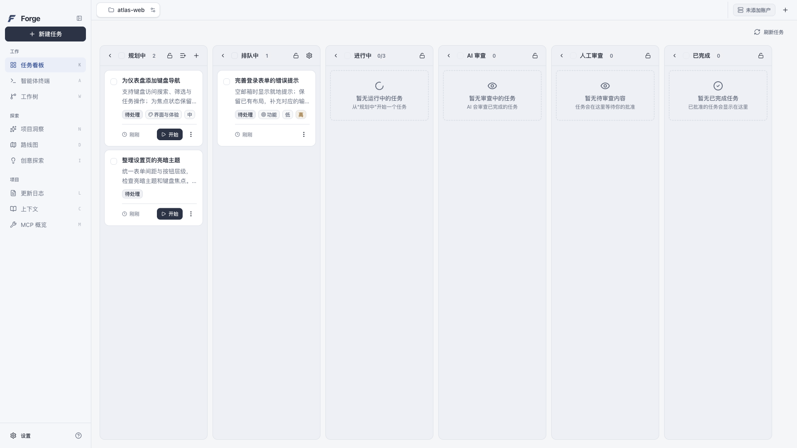
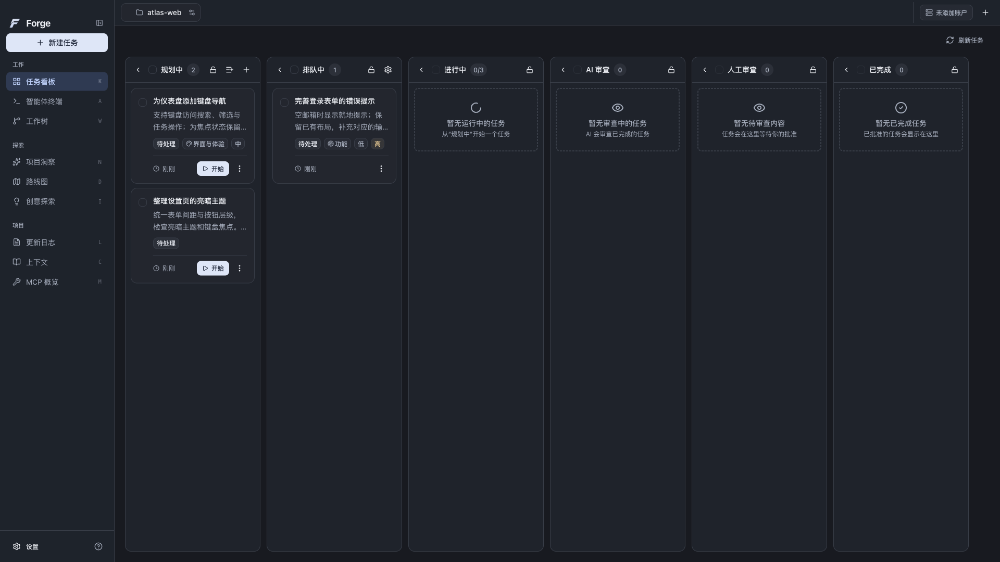
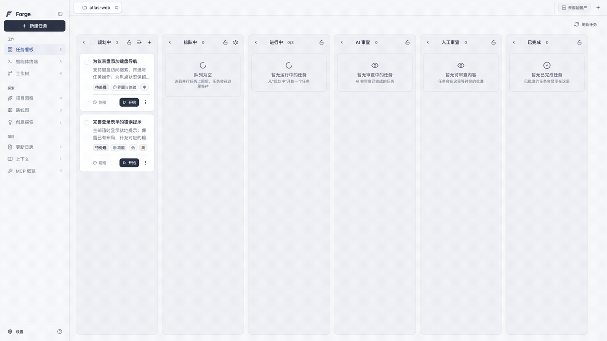
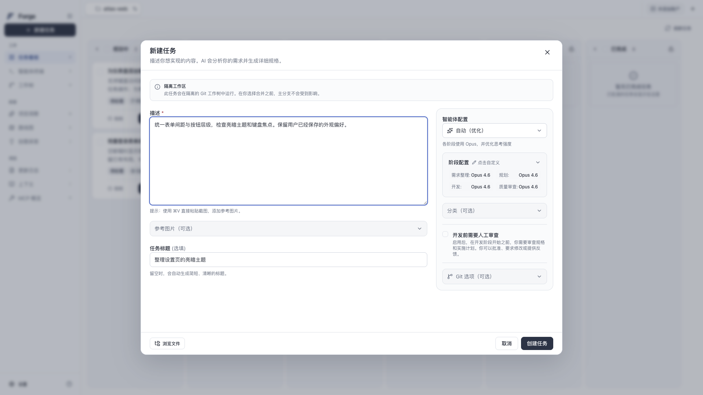
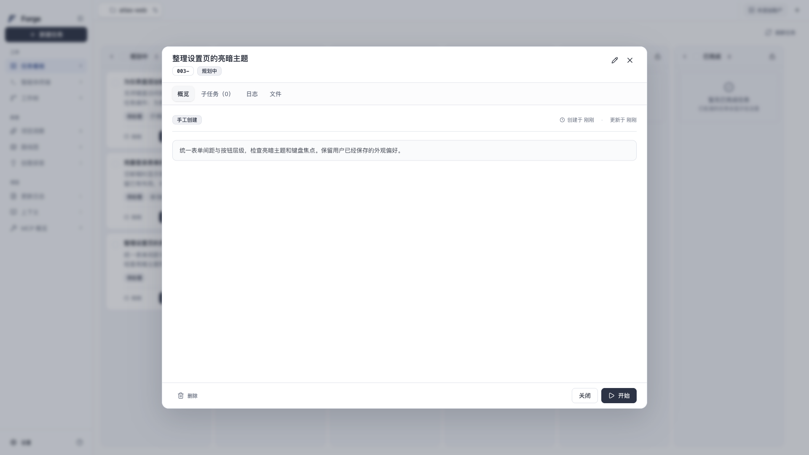
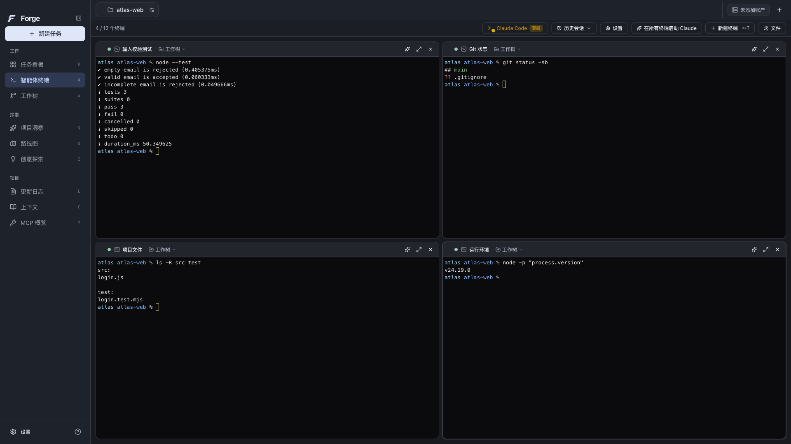

<div align="center">
  
  <h1>Forge</h1>
  <p><strong>从一个需求，到看得见的开发过程。</strong></p>
  <p>任务看板 · 阶段模型 · 代码审阅 · 多终端并行</p>
  <p>
    <a href="https://github.com/j-tide/Forge/releases/tag/v0.1.0-preview.6">下载预览版</a> ·
    <a href="docs/user-guide.md">使用指南</a> ·
    <a href="docs/development.md">开发文档</a> ·
    <a href="README.en.md">English</a>
  </p>
</div>

Forge 是面向代码项目的 AI 开发桌面应用。打开 Git 项目，描述你想完成的工作，为不同阶段选择模型，然后在看板中跟踪任务、阅读执行日志和审阅代码变化。项目、任务、终端与开发工具集中在同一个工作台里。



<details>
<summary>查看暗色任务看板</summary>



</details>

## 能用 Forge 做什么

- **把需求整理成任务。** 用自然语言描述目标，附上参考图片或通过 `@` 引用项目文件；未写完的内容可以保留为草稿。
- **为每个阶段选模型。** 分别配置需求整理、规划、开发和质量审查的模型与思考强度。账户配置提供显式连接测试，方便在开工前发现认证或连接问题。
- **在看板上跟踪进度。** 从规划、排队和开发，到 AI 审查、人工审查与完成，任务状态集中呈现；创建与开始执行是两个独立操作。
- **在任务旁审阅代码。** 详情中查看子任务、日志、文件和代码差异，提交反馈，并通过 Git 操作入口处理变更。
- **多个终端并排工作。** 在同一页面运行开发服务、测试和 Git 命令；四个终端自动组成 2×2 网格，还能重命名、调整顺序或展开单个终端。
- **围绕项目继续探索。** 项目洞察、创意探索、路线图、更新日志和上下文提供不同的项目入口，MCP 概览与本地记忆管理也在工作台内。
- **按自己的习惯阅读。** 切换亮暗主题与中英文，调整字体，减少动效或透明度；偏好在保存后保留，语言选择即时保存。

## 看板里的任务，从这里开始

演示新建任务、打开详情和把单个任务移入队列。需求与执行配置留在任务中，后续从详情跟进实际运行结果。



| 描述需求与配置阶段 | 查看任务详情 |
| --- | --- |
|  |  |

## 多个终端，一个开发现场

**打开项目 → 左侧「智能体终端」→「新建终端」**。在终端页，也可以按 **⌘+T / Ctrl+T**；每个项目最多新建 **12 个并行终端**。

四个终端自动排成 2×2 网格。双击标题重命名，拖动把手调整顺序，点击展开按钮专注一个终端，再收起回到网格。新建时打开普通 Shell；需要 Claude 时，使用终端上的「Claude」按钮，并配置可用的 CLI 和认证。


<details>
<summary>查看四终端暗色界面</summary>



</details>

截图与动图录自实际应用中的独立示例项目：任务未执行，终端运行实际本地命令，未演示在线智能体执行。[媒体来源](docs/media/readme/manifest.json) · [终端操作指南](docs/user-guide.md#多个终端并排工作)

## 下载与安装

当前版本为 **[0.1.0-preview.6](https://github.com/j-tide/Forge/releases/tag/v0.1.0-preview.6)**，提供 **macOS Apple Silicon（M 系列芯片）** 安装包。

**[下载 DMG](https://github.com/j-tide/Forge/releases/download/v0.1.0-preview.6/Forge-0.1.0-preview.6-darwin-arm64-INTERNAL.dmg)** · [下载 ZIP](https://github.com/j-tide/Forge/releases/download/v0.1.0-preview.6/Forge-0.1.0-preview.6-darwin-arm64-INTERNAL.zip) · [校验文件](https://github.com/j-tide/Forge/releases/download/v0.1.0-preview.6/SHA256SUMS)

打开 DMG，将 `Forge.app` 拖入 Applications；也可以解压 ZIP 后打开应用。升级前保存工作并正常退出旧实例。

这是尚未公证的内部预览包，请遵循 macOS 安全提示。完整在线流程及其他平台仍在验证中，使用前可查看[当前版本的已知限制](docs/releases/0.1.0-preview.6.md#未关闭风险)。

## 开始第一个任务

1. **打开项目。** 首页点击「打开项目」，选择已有至少一次提交的 Git 仓库，按提示初始化 Forge 项目数据。
2. **连接模型。** 左下角「设置」→「账户」，配置所选服务商的认证并保存，使用可用的测试入口检查连接；再到「智能体设置」选择阶段模型。
3. **描述目标。** 点击「新建任务」，填写需求，按需添加图片或文件引用，确认阶段模型、基准分支及审查选项，然后创建任务。
4. **开始并跟踪。** 在任务卡片或详情中点击「开始」。通过子任务、日志与文件查看进度，到人工审查阶段检查代码差异并给出反馈。

模型调用使用你自己的服务商账户，可能产生相应费用。不同服务商的连接测试范围不同，连接成功不等于完整任务执行成功。更详细的配置、操作与常见问题见[使用指南](docs/user-guide.md)。

## 从源码运行

技术栈为 **Electron + React + TypeScript**，使用单一 npm 工程。需要 **Node.js 24+、npm 10+、Git**；macOS 原生依赖构建需要 Xcode Command Line Tools。

```sh
git clone https://github.com/j-tide/Forge.git
cd Forge
npm ci --ignore-scripts
node node_modules/electron/install.js
npm run postinstall
npm run dev
```

代码按运行职责组织：

```text
src/main/       应用服务、Agent、Git 与终端
src/preload/    桌面 API 桥接
src/renderer/   React 界面
src/shared/     类型、国际化与共享逻辑
resources/      图标与平台资源
prompts/        运行时提示词
scripts/        构建、启动与检查工具
tests/          工具、UI 与端到端检查
docs/           使用、开发与发布文档
```

[开发入口与检查命令](docs/development.md) · [贡献指南](CONTRIBUTING.md) · [反馈问题](https://github.com/j-tide/Forge/issues)

## 文档与开源许可

- [使用指南](docs/user-guide.md)：账户配置、任务操作与常见问题。
- [开发文档](docs/development.md)：源码入口、运行结构与本地检查。
- [版本说明](docs/releases/0.1.0-preview.6.md)：本版改动、验证结果与已知限制。
- [实施记录](docs/implementation-status.md)：当前进展与待完成事项。

Forge 基于 [Aperant](https://github.com/AndyMik90/Aperant) `v2.8.0-beta.6`，以 [AGPL-3.0](LICENSE) 开源。感谢上游作者与贡献者；原作者版权、来源和修改记录见 [UPSTREAM.md](UPSTREAM.md)。发布页提供[与安装包对应的完整源码](https://github.com/j-tide/Forge/releases/download/v0.1.0-preview.6/Forge-0.1.0-preview.6-source.tar.gz)。
