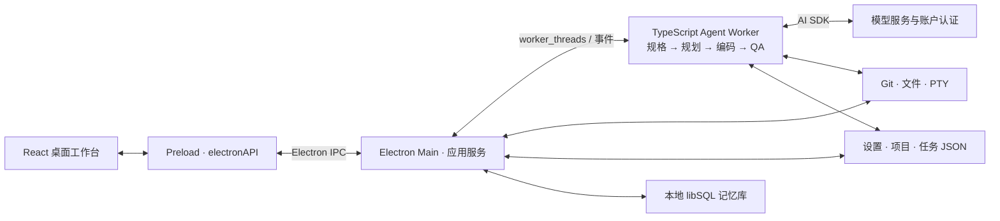

# Forge


**围绕代码项目组织任务、配置模型并查看开发活动的 AI 桌面工作台。**

**简体中文** / [English](README.en.md)

本仓库的应用与开发工程位于 [`desktop/`](desktop/README.md)，使用 **Electron + React + TypeScript** 和独立 npm workspace。

## 当前版本

[**0.1.0-preview.5 · macOS Apple Silicon**](https://github.com/j-tide/Forge/releases/tag/v0.1.0-preview.5) 为 **INTERNAL / ADHOC / UNNOTARIZED** 预发布，集中修复模型测试、任务操作和失败恢复。

| 下载 | 用途 |
| --- | --- |
| [DMG](https://github.com/j-tide/Forge/releases/download/v0.1.0-preview.5/Forge-0.1.0-preview.5-darwin-arm64-INTERNAL.dmg) | 打开后将 `Forge.app` 拖入 Applications。 |
| [ZIP](https://github.com/j-tide/Forge/releases/download/v0.1.0-preview.5/Forge-0.1.0-preview.5-darwin-arm64-INTERNAL.zip) | 解压后打开应用。 |
| [对应源码](https://github.com/j-tide/Forge/releases/download/v0.1.0-preview.5/Forge-0.1.0-preview.5-source.tar.gz) | 与发布 tag 对应的完整源码。 |
| [SHA256SUMS](https://github.com/j-tide/Forge/releases/download/v0.1.0-preview.5/SHA256SUMS) | 核对下载文件摘要。 |

安装前保存工作并正常退出正在运行的 Forge。此包尚未公证，请遵循 macOS 自身安全提示。

## 能做什么

| 功能 | 正常入口 |
| --- | --- |
| 项目与任务 | 打开代码目录，在看板创建任务、查看子任务、日志、文件和审阅结果；创建后另行开始执行。 |
| 模型与账户 | 应用设置配置服务商与阶段模型，显式测试连接；错误结果提供原因和重试。 |
| 项目设置 | 项目标签旁的配置入口管理当前项目，应用设置管理全局偏好。 |
| 开发工作区 | 查看 Git 分支、工作树与文件变化，使用集成终端；按任务配置执行与推送选项。 |
| 项目工具 | 使用洞察、想法、路线图、上下文、记忆和 MCP 配置入口。 |
| 外观与语言 | 银灰亮色／石墨暗色、中英文、减少透明度与动效，偏好在重启后保留。 |

模型调用需要所选服务商的有效认证、网络和相应费用授权。当前验证涵盖本地 UI、持久化与安装包；**完整在线 Agent 流程、外部 OAuth、全部模型与工具、Windows 和 macOS Intel 仍待验证**。活跃 Agent worker 的项目 `.env`／MCP override 配置链尚未接通，配置页面存在不代表该执行路径已生效。

## 实际运行结构



Main 注册项目、任务、终端与设置等 IPC；Agent Worker 编排模型会话，调用内置工具及 MCP，并回传日志和状态。任务文件保存在项目的 `.forge-glass-preview/`，设置与本地记忆使用隔离的 `Forge Glass Preview` 用户数据目录。任务可使用 Git worktree；当前创建失败时会回退项目目录。

## 界面

| 亮色 | 暗色 |
| --- | --- |
|  |  |
|  |  |

截图来自实际 `.5` Electron 编译代码，使用独立测试项目，没有在线 Agent 执行；[来源与摘要](desktop/docs/screenshots/0.1.0-preview.5/screenshots.json)。

## 源码开发

使用 **Node.js 24+、npm 10+、Git**。macOS 原生构建需要 Xcode Command Line Tools。

```sh
cd desktop
npm ci --ignore-scripts
node node_modules/electron/install.js
npm --workspace apps/desktop run postinstall
npm run dev
```

```sh
npm run check:i18n
npm run lint
npm run typecheck
npm test
npm run build

# 在 macOS 上检查真实 Electron 本地交互
npm run test:ui:desktop
npm run test:overlays:desktop
npm run test:files:desktop
npm run test:i18n:desktop

# 已构建安装包时正常打开当前版本
npm run preview:open
```

开发与检查均在 `desktop/` 执行，使用本目录的 `package-lock.json`。界面测试使用独立数据目录；类型检查和单元测试不能代替真实在线运行或目标平台验收。

## 文档与来源

[操作说明](desktop/README.md) · [实施状态](desktop/docs/implementation-status.md) · [版本验证](desktop/docs/releases/0.1.0-preview.5.md) · [打包与发布](desktop/RELEASE.md)

Forge 基于 [Aperant](https://github.com/AndyMik90/Aperant) `v2.8.0-beta.6`，按 [AGPL-3.0](desktop/LICENSE) 提供衍生源码。原作者、版权、导入来源与修改记录保留在 [UPSTREAM.md](desktop/UPSTREAM.md)，发布页提供对应源码。
