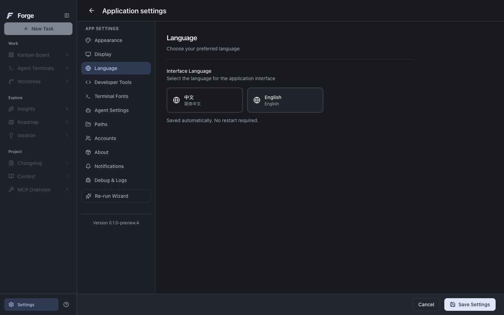

<div align="center">


# Forge

**面向 AI 编程的开源桌面工作台**

围绕代码项目，组织任务、配置 Agent、查看开发过程与代码变化。

[](https://github.com/j-tide/Forge/releases/tag/v0.1.0-preview.4) [](#下载安装) [](https://github.com/j-tide/Forge/actions/workflows/desktop-quality.yml) [](desktop/LICENSE)

[**下载预览版**](#下载安装) · [功能](#功能概览) · [快速上手](#快速上手) · [开发](#本地开发) · [参与贡献](#参与贡献)

**简体中文** / [English](README.en.md)

</div>

<picture>
  <source media="(prefers-color-scheme: dark)" srcset="desktop/docs/screenshots/0.1.0-preview.4/home-dark-1440.png" />
  
</picture>

<p align="center"><sub>真实 Electron 界面 · 亮色与暗色主题 · 中文 / English</sub></p>

Forge 将项目、任务、模型配置和开发活动放在同一个桌面应用中。你可以从本地 Git 项目开始，为任务补充文件与图片上下文，设置各阶段的 Agent，并在任务详情、终端和工作树中查看开发过程。

> [!NOTE]
> Forge 目前处于 **预览阶段**。`0.1.0-preview.4` 已验证 macOS Apple Silicon 的界面、本地交互与安装包启动；当前衍生桌面**尚未接入 Forge Python Host**，完整在线任务闭环仍待验收。具体范围见[项目状态](#项目状态)。

## 功能概览

| 能力 | 在 Forge 中做什么 |
| --- | --- |
| **项目与任务** | 打开本地代码项目，通过看板组织任务，在详情中查看进度、子任务、日志与文件。 |
| **需求与上下文** | 用自然语言描述目标，通过 `@` 引用项目文件、添加参考图片，并保存任务配置。 |
| **Agent 与模型** | 为需求整理、规划、开发和质量审查分别选择模型，管理服务商认证与执行参数。 |
| **终端与工作树** | 在工作台中查看命令活动、任务工作树与代码变化，检查基准分支及审阅、推送选项。 |
| **项目探索** | 通过项目洞察、路线图、创意探索、上下文与 MCP 概览访问项目分析和工具配置。 |
| **界面与偏好** | 即时切换中文 / English、亮色 / 暗色；保留语言与主题偏好，支持键盘操作、减少动效与透明度。 |

以上为当前桌面的功能入口；在线模型、执行器及外部工具需要各自的认证和配置，验证范围见下方状态说明。

<details>
<summary><strong>查看任务创建与语言设置</strong></summary>

<br />

| 描述需求并配置任务 | 切换语言与主题 |
| --- | --- |
|  |  |

截图来自 `0.1.0-preview.4` 的真实 Electron 窗口。标有「UI 测试」的项目与任务为隔离测试数据；这些画面未执行在线 Agent。来源与文件摘要见[截图记录](desktop/docs/screenshots/0.1.0-preview.4/screenshots.json)。

</details>

## 下载安装

当前预览版本：**0.1.0-preview.4**。提供 **macOS Apple Silicon（M 系列芯片）** 安装包。

| 下载 | 用途 |
| --- | --- |
| [**macOS DMG**](https://github.com/j-tide/Forge/releases/download/v0.1.0-preview.4/Forge-0.1.0-preview.4-darwin-arm64-INTERNAL.dmg) | 打开后将 `Forge.app` 拖入 Applications。 |
| [macOS ZIP](https://github.com/j-tide/Forge/releases/download/v0.1.0-preview.4/Forge-0.1.0-preview.4-darwin-arm64-INTERNAL.zip) | 解压后打开 `Forge.app`。 |
| [对应源码](https://github.com/j-tide/Forge/releases/download/v0.1.0-preview.4/Forge-0.1.0-preview.4-source.tar.gz) | 与发布 tag 对应的完整源码。 |
| [SHA256SUMS](https://github.com/j-tide/Forge/releases/download/v0.1.0-preview.4/SHA256SUMS) | 核对下载文件的 SHA-256 摘要。 |

下载后核对校验摘要，正常退出旧版 Forge，再从 Finder 打开新版。版本改动、构建信息与已知问题见[发布说明](desktop/docs/releases/0.1.0-preview.4.md)；历史版本见 [Releases](https://github.com/j-tide/Forge/releases)。

> [!IMPORTANT]
> 当前安装包为 **INTERNAL / ADHOC / UNNOTARIZED** 预发布，使用 ad-hoc 签名，尚未完成 Developer ID 签名与公证。请遵循 macOS 的安全提示；无需全局关闭 Gatekeeper。

## 快速上手

使用项目功能需要 **Git**；调用模型需要你自己的有效认证和网络连接，部分执行器还需要安装相应 CLI。首次试用建议使用测试仓库。

1. **打开项目** — 在首页选择本地代码目录，按提示完成项目初始化。
2. **配置模型** — 在「设置 → 账户」配置认证，到「智能体设置」选择各阶段的服务商与模型；需要 CLI 时在「路径」中配置。
3. **创建任务** — 点击「新建任务」，描述目标、引用相关文件，检查基准分支、工作树及审阅、推送选项后保存。
4. **明确开始** — 创建任务后，在看板中点击「开始」才进入执行。开始前确认模型配置与执行选项。
5. **查看过程** — 打开任务详情查看进度、日志和文件；结合「智能体终端」与「工作树」检查开发活动和代码变化。

项目标签旁的配置按钮管理当前项目；左下角「设置」管理应用偏好。更完整的入口说明见[桌面使用与开发文档](desktop/README.md#操作入口)。

## 项目状态

Forge 当前优先完成桌面体验、Python Host 集成与安装态验收。以下状态对应 **0.1.0-preview.4**，测试记录随版本保留。

| 范围 | 当前状态 |
| --- | --- |
| macOS Apple Silicon 桌面 | 已验证亮暗界面、项目设置、任务本地保存、键盘操作及语言 / 主题重启恢复。 |
| macOS 安装包 | DMG 挂载启动、包内资源一致性与 ad-hoc 签名检查通过；正式签名、公证与签名更新待验。 |
| Forge Python Host | 仓库内已有独立实现；当前 `desktop/` 衍生应用尚未接入。 |
| 在线任务与外部集成 | 当前版本的完整 Agent 任务闭环、Claude、外部 MCP 与第三方集成仍待验收。 |
| 其他平台 | Windows、macOS Intel 尚未完成实机验证；Linux CI 覆盖静态检查、单元测试与构建。 |
| 手机与远程协作 | 新增开发后置，远程网络入口默认关闭。 |

本版仍有已记录的依赖审计风险，详情见[发布说明中的未关闭风险](desktop/docs/releases/0.1.0-preview.4.md#未关闭风险)。完整进度与验收证据见[实施记录](docs/implementation-status.md)。

## 本地开发

### 运行桌面应用

当前桌面源码位于 `desktop/`，使用 **Electron + React + TypeScript** 和独立 npm workspace。

前置条件：**Node.js 24+、npm 10+、Git**。macOS 原生模块构建需要 Xcode Command Line Tools；原生依赖的其他要求见[桌面开发文档](desktop/README.md#源码开发)。

```sh
git clone https://github.com/j-tide/Forge.git
cd Forge/desktop

# 安装锁定依赖
npm ci --ignore-scripts

# 安装 Electron 运行时并准备原生模块
node node_modules/electron/install.js
npm --workspace apps/desktop run postinstall

# 启动开发环境
npm run dev
```

### 检查与构建

以下命令均在 `desktop/` 执行，与[桌面 CI](.github/workflows/desktop-quality.yml) 的检查项目对应：

```sh
npm run check:i18n
npm run lint
npm run typecheck
npm test
npm run build
```

涉及桌面交互的修改，还需在 macOS 运行真实 Electron 回归：

```sh
npm run test:ui:desktop
npm run test:overlays:desktop
npm run test:files:desktop
npm run test:i18n:desktop
```

这些界面检查使用独立测试数据，不调用在线模型。打包步骤见[发布开发说明](desktop/RELEASE.md)。

### 仓库结构

```text
Forge/
├── desktop/       # 当前衍生桌面：Electron + React，独立 npm workspace
├── python/        # Forge Python Host / Core 与 Python 测试
├── apps/          # 原 Forge 桌面与 Vue UI；旧 Node Host 作为迁移对照
├── packages/      # 公开契约、客户端、共享 UI、校验器与迁移对照代码
├── plugins/       # 原 TypeScript 插件迁移对照
├── tests/         # 原 Forge 集成测试与验收夹具
└── docs/          # 架构决策、实施记录与验收证据
```

已批准的目标架构由 **Python Host** 统一管理任务、审批、执行与证据，桌面通过有版本的 **JSON-RPC over stdio** 通信。当前衍生桌面的集成工作仍待完成；架构与迁移边界见 [ADR 0029](docs/decisions/0029-python-core-runtime-architecture.md) 和 [ADR 0087](docs/decisions/0087-aperant-derived-desktop-base.md)。

<details>
<summary><strong>开发 Python Host 与原 Forge 工程</strong></summary>

仓库根目录使用独立的 pnpm 工程：Node.js `>=22.13.0 <23`、pnpm `12.3.4`。Python 使用 `3.12+` 和 uv；工具版本记录在 [versions.lock.json](versions.lock.json)。根目录与 `desktop/` 使用不同的 Node 要求和锁文件，请在对应环境中执行命令。

在仓库根目录运行：

```sh
pnpm install --frozen-lockfile
pnpm py:check          # 同步 Python 依赖，运行 Ruff、mypy 与 pytest
pnpm dev:python-host   # 独立启动 stdio Host
```

Host 的标准输出用于协议通信。上述命令不会将当前衍生桌面连接到 Host。模块入口与迁移记录见 [Python 模块清单](docs/python-core-module-inventory.md)和[迁移计划](docs/forge-python-core-migration-plan.md)。

</details>

## 参与贡献

欢迎问题反馈、文档改进、翻译和代码贡献。

- **报告问题**：通过 [Issues](https://github.com/j-tide/Forge/issues) 提供版本、操作系统、复现步骤和预期结果；日志与截图请先移除密钥及个人信息。
- **提出功能**：说明使用场景与预期行为。涉及架构、权限或产品状态的变更，先讨论方案并记录架构决策。
- **提交改进**：保持每个 PR 聚焦一个问题，附上实际验证结果；界面修改附上截图，未验证的平台如实说明。

修改前请阅读 [AGENTS.md](AGENTS.md)。桌面与根工程分别执行对应检查；保留已有用户数据、许可证和来源声明。

## 文档导航

| 文档 | 内容 |
| --- | --- |
| [桌面使用与开发](desktop/README.md) | 操作入口、配置、数据目录与本地开发。 |
| [版本说明](desktop/docs/releases/0.1.0-preview.4.md) | 本版变更、截图、安装包摘要与已知问题。 |
| [桌面 UI / UX 走查](docs/desktop-ui-ux-audit.md) | 界面、交互、键盘操作与修复记录。 |
| [Python Core 迁移计划](docs/forge-python-core-migration-plan.md) | 独立业务 Runtime 的迁移步骤与验证边界。 |
| [架构决策](docs/decisions/) | 技术路线、状态、权限与安全规则。 |
| [实施记录](docs/implementation-status.md) | 各版本的实际进度、检查结果与未验项目。 |

## 致谢与许可证

Forge 的当前桌面基于 [Aperant](https://github.com/AndyMik90/Aperant) **`v2.8.0-beta.6`** 衍生开发，采用 [GNU AGPL-3.0](desktop/LICENSE)。感谢 AndyMik90 与上游贡献者；原作者的版权、许可与来源声明保留。Forge 由本项目独立维护。

导入版本、原始提交与修改记录见 [UPSTREAM.md](desktop/UPSTREAM.md)。发布页提供与版本对应的完整源码；其他目录的许可边界遵循各自声明与 [ADR 0087](docs/decisions/0087-aperant-derived-desktop-base.md)。
