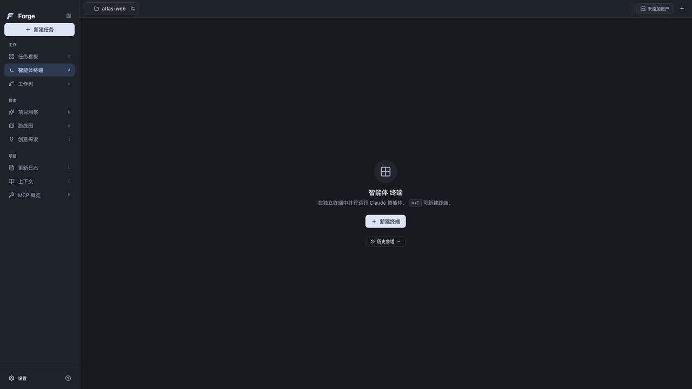

# Forge 使用指南

从打开一个代码项目，到配置模型、创建任务、检查结果，本指南按日常操作顺序介绍当前桌面预览版。

## 下载与安装

当前版本是 [0.1.0-preview.6](https://github.com/j-tide/Forge/releases/tag/v0.1.0-preview.6)，安装包适用于 **macOS Apple Silicon（M 系列芯片）**。

1. 从发布页下载 `Forge-0.1.0-preview.6-darwin-arm64-INTERNAL.dmg`；也可选择 ZIP。发布页的 `SHA256SUMS` 用于核对下载文件。
2. 打开 DMG，把 `Forge.app` 拖入「应用程序」；使用 ZIP 时先解压，再移入「应用程序」。
3. 保存工作并退出正在运行的旧 Forge，再从「应用程序」打开新版。

本包尚未公证。遇到系统拦截时，按 macOS「系统设置 → 隐私与安全性」中的提示处理。首次尝试建议使用可以恢复的代码仓库。

## 打开项目

在首页点击「打开项目」，选择代码目录。近期打开的项目会显示在首页；打开多个项目后，通过顶部标签切换当前项目。

首次打开时，按提示初始化 Forge。项目需要安装可用的 Git，并且至少已有一次提交；新项目先完成 Git 初始化和首次提交。Forge 会在项目中创建 `.forge-glass-preview/`，保存任务规格、日志等数据，并将该目录加入 `.gitignore`。

如果「新建任务」不可用，先检查项目是否已初始化；初始化失败时，按页面错误检查 Git、目录权限和当前配置。

## 配置账户和模型

### 先添加账户

点击左下角「设置」，进入「账户」。选择服务商和认证方式，按表单填写账户名称、API 密钥与服务地址，或完成相应的登录流程。自定义兼容端点还需填写服务端实际支持的模型 ID。

已有账户可以在账户卡片上编辑、测试连接或重新认证。填写和保存账户后，仍需检查实际测试结果。

| 操作 | 检查内容 |
| --- | --- |
| 「测试连接」 | 检查服务地址或认证元数据。读取模型列表成功，并不表示模型有生成权限或可用额度。 |
| Z.AI「测试模型」 | 先选测试模型，再明确点击按钮发送一次简短请求；可能产生 API 费用或消耗套餐额度。 |
| OAuth「重新认证」 | 重新执行登录流程；API 密钥的连接检查无法验证 OAuth 账户。 |

「检查未通过」下面会显示原因。认证失败时检查密钥和账户权限；额度或限流错误需要在服务商侧处理；地址、网络或超时错误先检查基础 URL 与连接。改变配置后重新测试，以新的结果为准。

### 再设置各阶段的模型

进入「智能体设置」，选择已配置的服务商。可以先使用「均衡」「快速修改」等预设，再展开「阶段配置」，分别调整 **需求整理、规划、开发、质量审查** 的模型与思考深度。

这些配置作为新任务的默认值；创建任务时可以单独调整。使用 Ollama 时，先在「账户」连接服务器，再选择服务器上实际可用的模型。配置了多个服务商时，可在「跨服务商」中组合各阶段；启用「新任务使用此配置」后，新任务才会采用该组合。

## 创建并开始任务

1. 选择当前项目，点击侧栏「新建任务」。
2. 写明目标、限制与预期结果。输入 `@` 或点击「浏览文件」引用项目内文件，也可以添加参考图片。示例：`修复登录表单：空邮箱时显示提示，保留现有样式，补充对应测试。`
3. 检查模型、阶段配置和 Git 选项。保留「使用项目默认分支」时采用项目默认分支；选择指定分支时确认它仍然存在。
4. 按需要开启「开发前需要人工审查」。检查「使用隔离工作区」和「自动推送新分支」，再点击「创建任务」。
5. 在「任务看板」打开新任务，点击「开始」执行。任务可能先进入队列；以详情中的实际状态为准。

创建任务用于保存需求与执行配置，执行从「开始」进入。需要人工审查时，检查生成的规格和计划，再决定继续编码或提出修改。运行中可以使用「停止」；中断或认证暂停后，根据详情提示选择恢复、继续或重新配置账户。

隔离工作区选项使用 Git worktree，但当前版本创建失败时可能回退项目目录。运行前保存自己的修改，检查任务显示的实际工作区。「自动推送新分支」控制相应推送行为，不能作为模型所有 Shell 操作的远程权限边界。

## 查看进度与审阅结果

从「任务看板」打开任务详情：

| 页面 | 用途 |
| --- | --- |
| 「概览」 | 查看需求、执行状态、提醒与审查操作。 |
| 「子任务」 | 查看规划后的实施步骤与完成情况。 |
| 「日志」 | 查看各阶段的消息、工具活动和错误；失败时先从这里定位原因。 |
| 「文件」 | 在任务已有规格文件时查看其内容，必要时在 IDE 中打开。 |

任务进入审查后，检查工作区差异、测试结果和实际代码，再选择反馈、暂存或合并等操作。「已完成」表示任务流程的状态；提交、推送、创建 PR 和部署还需检查各自的实际结果。

「智能体终端」用于查看终端会话；「上下文」「项目洞察」「路线图」「创意探索」提供其他项目入口。需要模型或外部服务的功能，使用前检查相应账户和授权。

## 多个终端并排工作

打开项目后，点击左侧「智能体终端」，再点击「新建终端」。也可以在终端页面按 **macOS ⌘+T** 或 **Windows／Linux Ctrl+T**。连续新建四个终端后，界面自动排成 **2×2 网格**；每个项目最多新建 12 个活动终端。

新建终端先打开普通 Shell，可以分别运行开发服务、测试或 Git 命令。需要启动 Claude 时，点击对应终端的「Claude」按钮，或工具栏「在所有终端启动 Claude」；这需要可用的 Claude Code CLI 和相应认证。

- **重命名**：双击终端标题，输入名称，按 Enter 保存。
- **调整顺序**：拖动标题左侧的把手，把相关终端放在一起。
- **展开／收起**：点击标题右侧的展开按钮，或按 ⌘+Shift+E／Ctrl+Shift+E，在单个终端与网格之间切换。
- **关闭**：点击终端右上角的 ×，或按 ⌘+W／Ctrl+W 关闭当前终端。

## 项目设置与应用设置

| 入口 | 修改范围 | 保存方式 |
| --- | --- | --- |
| 顶部当前项目标签旁的配置按钮 →「项目设置」 | 当前项目的默认分支、项目偏好及集成选项 | 项目偏好点击「保存项目设置」；集成选项按页面提示即时保存。 |
| 左下角「设置」→「应用设置」 | 账户、默认智能体、外观、语言、显示、工具路径与通知 | 按页面保存提示操作；外观与应用偏好点击「保存设置」。 |

切换设置前看清页面显示的项目名。保存失败时保留当前输入，处理页面错误后重试。

外观可选择亮色或暗色，并开启「减少动效」「减少透明度」；在「显示」调整界面大小。外观即时预览后，点击「保存设置」保留选择。在「语言」切换中文或 English，选择成功后即时生效并自动保存。系统辅助功能偏好也会影响实际动效与透明度。

## 常见问题

**连接检查通过，任务为什么还失败？**

连接检查覆盖有限的服务接口。模型权限、额度、执行工具、项目环境和完整任务流程仍可能失败；查看任务日志，并核对任务实际选中的账户与模型。

**升级后设置和任务放在哪里？**

应用设置和账户保存在 `Forge Glass Preview` 用户数据目录，项目任务保存在项目的 `.forge-glass-preview/`。当前版本保持这些数据身份，正常升级后使用原有配置；备份项目时也保留项目任务目录。

**为什么配置了记忆或 MCP，却没有看到任务使用？**

当前预览版尚未完整接通 Agent Worker 的记忆与项目 MCP 配置链。页面可配置或读取数据，并不保证任务已使用该配置。其他在线服务、完整任务闭环和额外平台的验证范围见[本版发布说明](releases/0.1.0-preview.6.md)。

**在哪里查版本或反馈问题？**

进入「应用设置 → 关于」查看预览版信息。反馈时提供版本、系统、复现步骤和必要日志，去掉密钥与私人代码；可在 [GitHub Issues](https://github.com/j-tide/Forge/issues) 提交问题。

源码运行与目录说明见[开发文档](development.md)，当前验证结果见[实施状态](implementation-status.md)，维护者发布流程见[发布说明](releasing.md)。项目来源与许可见 [UPSTREAM.md](../UPSTREAM.md) 和 [LICENSE](../LICENSE)。
