# Forge 页面与设计系统规格

本文件与离线原型 index.html 对应。原型只演示交互与信息层级，所有执行记录都是示例。

## 设计方向：Editorial Workbench
不是传统黑色终端拼盘，也不是卡通办公室。深石墨侧轨、温暖纸白画布、铜橙强调；用稳定的留白、明确的任务状态和证据层级建立辨识度。F形符号只是初版几何标记，不声称已完成商标设计。

## 尺寸与交互
- Desktop参考1600×1000；最小1280×800。左轨68、顶栏62、聊天默认318可在280–420调宽，正文卡片12px圆角以内。小于1440折叠次要详情；看板可横向滚动，不压缩成不可读卡片。
- 手机参考390×844；列表替代五列看板，底部操作不被软键盘覆盖。支持safe-area与系统字体放大。
- 网格4/8；正文建议14px、次级12px、标题24px；代码使用系统等宽字体。原型为密集示意，生产需做字体/DPI/无障碍实测。
- 常用快捷键Cmd/Ctrl+K、Cmd/Ctrl+Enter、Esc；重要操作有按钮，不强迫记快捷键。停止/删除/批准不绑定易误触的单键。
- 动画120–180ms，prefers-reduced-motion下关闭位移动画；状态不只靠颜色。
- 左侧聊天输入与上下文对象分离；用户原话始终可查看。工具事件不是思维链。

## 核心组件
AppShell、ProjectSwitcher、HostBadge、CommandChat、DraftCard、AcceptanceEditor、BoardColumn、TaskCard、RunInspector、ActivityFeed、ArtifactViewer、SnapshotBadge、ReviewIssue、VerificationMatrix、WorkflowCanvas、NodeInspector、ProfileForm、PluginCard、SourceCitation、MemoryCandidate、DevicePairing、ConfirmDialog、EmptyState、ErrorBanner。

## 状态规范
每个异步组件实现idle/loading/success/error/empty/stale/offline/unauthorized；按钮在处理中禁用但给出取消入口。服务器拒绝时保留输入；乐观UI只用于非高风险排序，审批/开始/合并必须等真实receipt。格式化后的最终输出不能覆盖原始产物。

## 实现约束
Vue3 + TypeScript + Reka UI primitives + 自有tokens；高级画布使用Vue Flow。主题、密度与平台快捷键由共享UI层处理；Electron特有API仅通过PlatformBridge。移动复用领域组件与RemoteTransport，不直接import Electron。图标使用单套开源SVG，并保存许可证。不得把原型HTML的DOM字符串拼接作为真实产品架构照搬。

## D01 · 研发看板

路由：`#board`；阶段：P1 / P6；模块：M03,M05,M13

**目的：** 让用户同时表达需求、查看执行，并知道下一项需要自己做的决定。

**布局：** 左轨导航；顶部项目/分支/Host 状态；318px 可折叠聊天；五列看板；底部当前 Run 摘要。

**字段：** 卡片：编号、标题、业务类型、状态文本、当前执行器、阻塞标记、已接受/已合并标记。不按时间伪造完成百分比。

**操作：** 创建/编辑草稿；选择已批准 TODO 开始；点击卡片进入详情；拖动只发 Command 并验证门禁；批量启动后置。

**状态与错误：** 空项目显示选择仓库；无任务提供示例输入；Host 掉线整板只读并显示最后同步时间；启动失败留在可重试状态。

**接口：** projects 查询、board 查询、runs.start/tasks.reorder；conversations.send；event cursor。

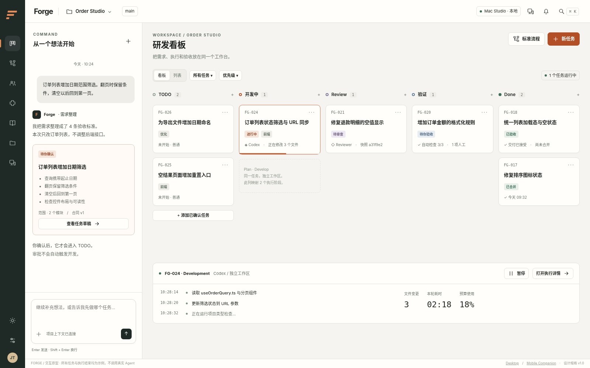

## D02 · 任务草稿与审批

路由：`#draft`；阶段：P1；模块：M03,M04

**目的：** 把模糊意图转成双方确认的可执行约定，审批与开工分离。

**布局：** 左侧保留原话与澄清；主区可编辑 Goal、Acceptance、Scope；右区流程、优先级、依赖与审批对象。底部固定审批栏。

**字段：** title、type、goal、acceptance[id,text,verification]、constraints、scope、outOfScope、openQuestions、sourceRefs、workflowRef。

**操作：** 增删验收项；回复未解问题；保存草稿 revision+1；预览 diff；批准当前 revision 进入 TODO；不得替用户默认排除后端改造。

**状态与错误：** 有关键未解问题时批准禁用；保存冲突显示两版本；模型失败保留用户草稿；审批过期强制刷新再确认。

**接口：** tasks.revise/tasks.approve；TaskContractSchema；If revision/CAS。

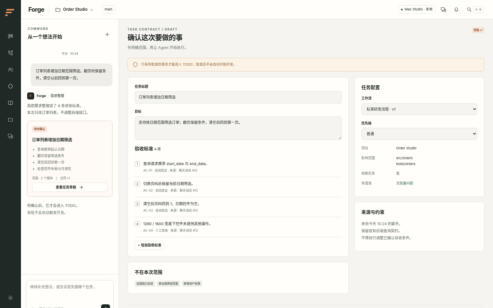

## D03 · 任务详情与交付历史

路由：`#task`；阶段：P1 / P3；模块：M04,M05,M10

**目的：** 用一份任务页面串起原始意图、当前合同、执行、决策和最终代码。

**布局：** 主区合同/执行记录/交付物/决策 Tab；右区状态、依赖、工作区与流程版本；主按钮依当前状态变化。

**字段：** taskId、revision、approval 状态、workflowVersion、activeRun、snapshot、unresolvedIssues、merge 状态。

**操作：** 开始、请求暂停、补充需求、创建新revision、重新执行；编辑活跃任务先暂停并生成新版本，不改旧执行历史。

**状态与错误：** 前置依赖未完成→Blocked；运行仍在停止→禁止再次开始；已归档→只读；旧报告带“针对旧快照”。

**接口：** tasks/{id}、runs 查询、runs.start/tasks.revise/runs.pause/runs.cancel。

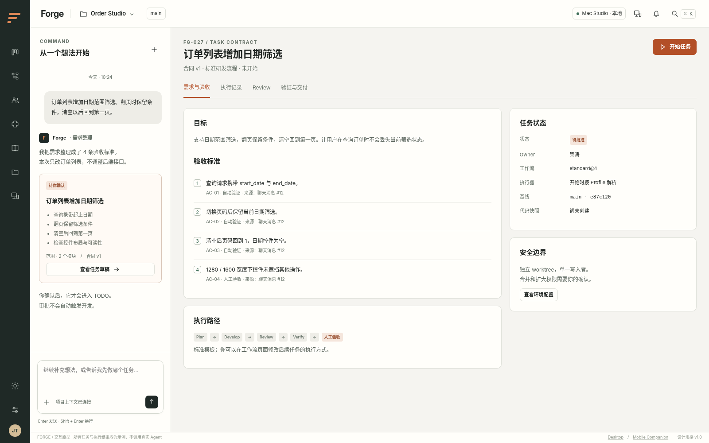

## D04 · 执行观察与控制

路由：`#run`；阶段：P2 / P3；模块：M07,M09,M13

**目的：** 只展示真实动作、产物与可核查摘要；提供可靠的停止、恢复和排障入口。

**布局：** 主区时间线与终端/差异/产物 Tab；右区冻结配置、预算、上下文来源；顶部状态、暂停、停止。

**字段：** runId、attemptId、stepId、lastSeq、executor/sessionRef、usage.actualOrEstimated、lease、processStatus。

**操作：** 暂停→pausing直到执行器确认；停止→canceling直到进程树退出；点击事件定位产物；导出脱敏运行包。

**状态与错误：** 事件断线→保留最后seq并补拉；未知外部副作用→reconcile_required；日志过长虚拟滚动；隐藏敏感值。

**接口：** runs/{id}、runs/{id}/events、runs.pause/resume/cancel；artifacts 只读。

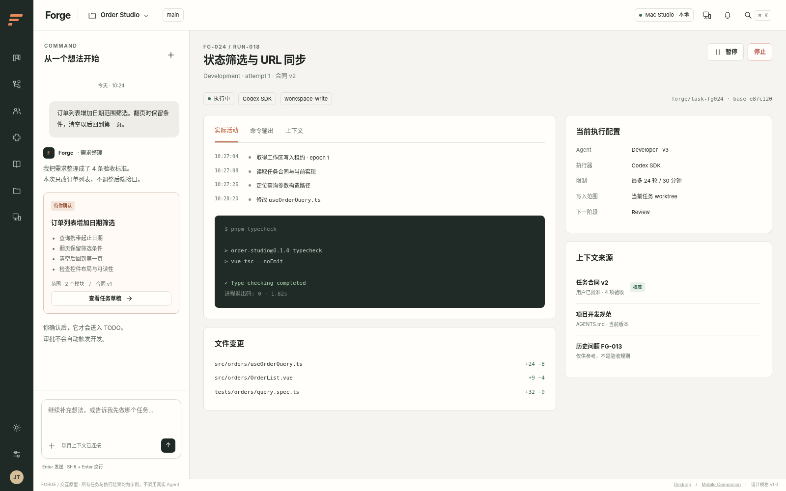

## D05 · Review 与代码证据

路由：`#review`；阶段：P3；模块：M10,M11

**目的：** 让审查判断绑定需求版本和代码快照，而不是绑定开发者的完成声明。

**布局：** 左主区 Diff + 文件列表；问题卡可定位代码；右区快照、阻塞项、风险接受与审查来源。

**字段：** reviewIssue{id,severity,blocking,file,line,evidence,status}；taskRevision；snapshotId；reviewerProfileVersion。

**操作：** 退回开发携带问题；采纳修复后在新快照复审；用户显式接受风险，不能伪造 reviewPassed。

**状态与错误：** 快照变更→stale；结果缺证据→incomplete；仍有阻塞项→禁止普通通过；敏感文件内容遮挡。

**接口：** Review结果与issue状态更新/review.acceptRisk；step result schema；artifact.diff 查询。

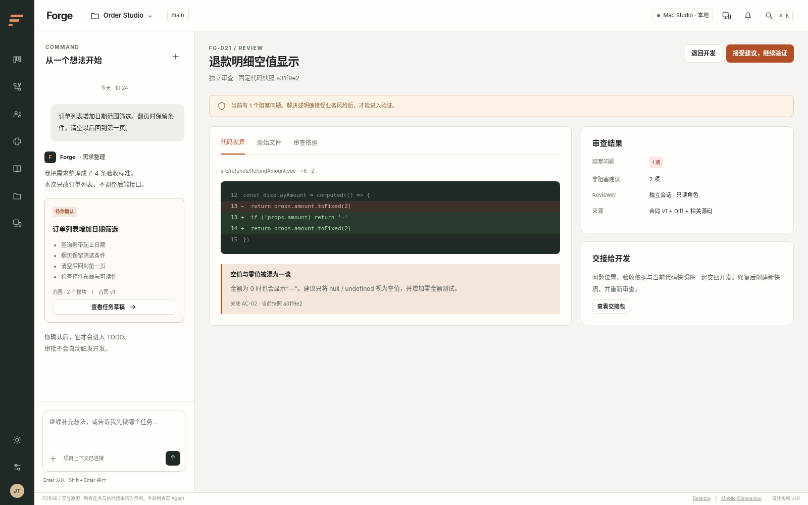

## D06 · 验证与人工交付验收

路由：`#verify`；阶段：P3 / P6；模块：M12

**目的：** 逐条验收并区分构建通过、需求通过与最终交付接受。

**布局：** 顶部构建/类型检查/测试/快照指标；主区每条AC与证据；右区交付摘要；底部人工接受与退回。

**字段：** AC状态 passed/failed/not_run/needs_human/not_applicable（需理由）；snapshotId、reportRef、unresolvedIssues、humanDecision。

**操作：** 运行预设命令；查看日志；人工完成未自动化项；接受精确快照后进入Done；合并是独立授权动作。

**状态与错误：** 无测试框架→not_run而非passed；命令退出0但测试0条→按配置标记不充分；结果过期需重新运行。

**接口：** verify.run/acceptance.decide/拒绝验收/Review结果触发返工/deliveries.merge；verified snapshot CAS。

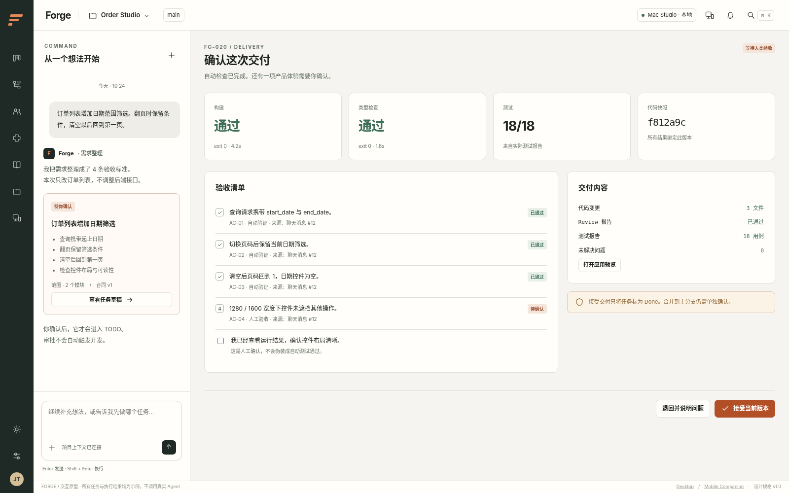

## D07 · 工作流模板库

路由：`#workflows`；阶段：P5；模块：M06

**目的：** 默认可用，但不限制用户只能使用固定研发流程。

**布局：** 模板卡 Standard/Fast/Strict；每张显示节点摘要、版本、引用任务数；项目默认设置独立。

**字段：** workflowId/version/name/nodeCount/reworkLimit/finalAcceptance；draft/published/retired。

**操作：** 复制模板；编辑草稿；设项目默认；导入受限JSON/YAML；只归档无新任务使用，不破坏旧Run。

**状态与错误：** 缺少插件→禁用开始并定位节点；非法配置显示语义错误；升级只影响新Run。

**接口：** workflow.list/get/workflows.saveDraft/publish/setProjectDefault。

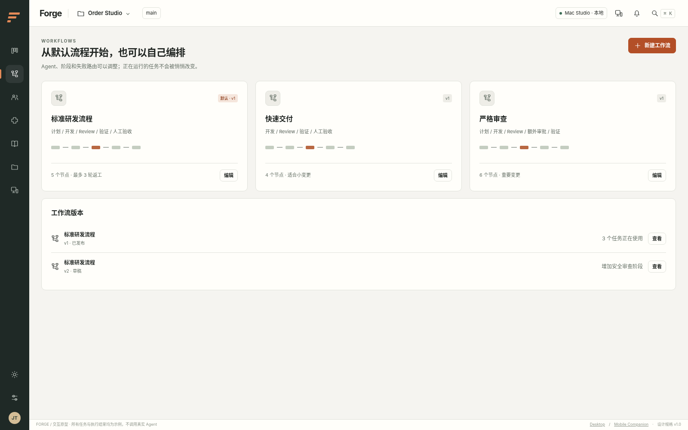

## D08 · 工作流编排器

路由：`#workflow`；阶段：P5；模块：M06,M08

**目的：** 以同一份声明式定义支撑表单编排与高级画布，不维护两套引擎。

**布局：** 工具栏步骤配置/高级画布；中区节点；右区选中节点表单；底部校验结果。实线正常路径，虚线有界返工。

**字段：** 节点 type/profile/verifier/context/permissions/entryGate/exitGate；正常edges；reworkRoutes；maxAttempts；boardColumn。

**操作：** 增删节点、排序、连线、绑定角色、配置失败出口；发布前编译验证；快照化生成新workflowVersion。

**状态与错误：** 正常图环路/悬空节点/无出口/不兼容权限→不能发布；删除被引用角色提示具体节点；并行写入后置。

**接口：** workflows.validate/workflows.publish；WorkflowSchema + semantic compiler。

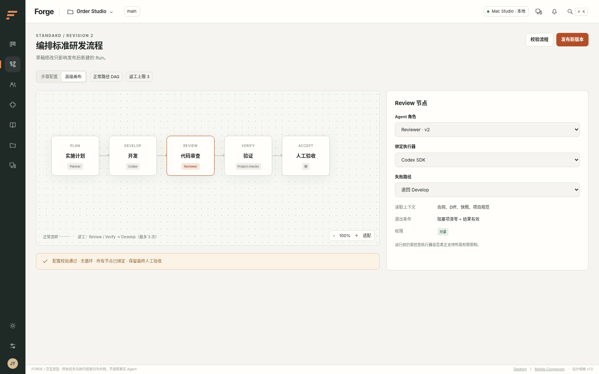

## D09 · Agent 角色库

路由：`#agents`；阶段：P4；模块：M09

**目的：** 把角色、执行器、模型和权限分开配置，而不是给一个模型取几个名字。

**布局：** 角色卡：目标、执行器、模型来源、权限概要、状态、版本；筛选开发/审查/产品；兼容性横幅。

**字段：** profileId/revision/executorId/provider/modelRef/contextSources/requiredCapabilities/budget/outputSchema。

**操作：** 创建/复制/编辑；能力探测；创建新版本；只展示当前执行器支持的模型；只读要求无法落实时阻断。

**状态与错误：** 凭据未配置、执行器未安装、模型不支持均有明确修复路径；配置开关不得假装权限已生效。

**接口：** agents.list/executors.probe/profiles.save。

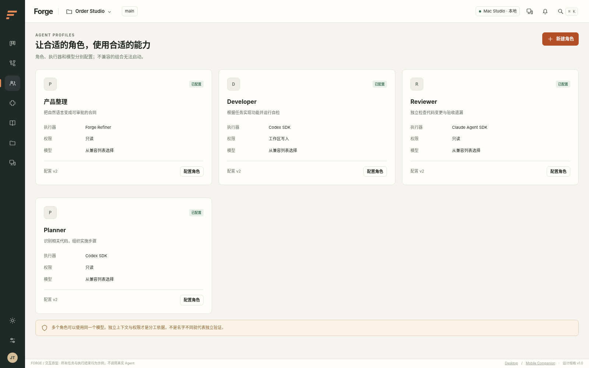

## D10 · 角色与执行器配置

路由：`#profile`；阶段：P4；模块：M09,M17

**目的：** 使角色配置可审阅、可版本化，并显式说明底层执行限制。

**布局：** 左表单角色指令、执行器、模型、上下文；右权限/预算/能力报告；下部输出Schema与测试连接。

**字段：** 角色名、说明、系统指令模板、executorId、modelRef、toolAllowlist、maxCalls/maxCost、credentialRef，不展示原始Key。

**操作：** 探测能力；使用已授权凭据；测试安全任务；保存新revision；导出配置时剔除凭据。

**状态与错误：** 危险权限扩大→本机确认；不支持native pause→标记阶段边界暂停；云模型数据发送范围提示。

**接口：** profiles.save/executors.probe/credentials.set（local only）。

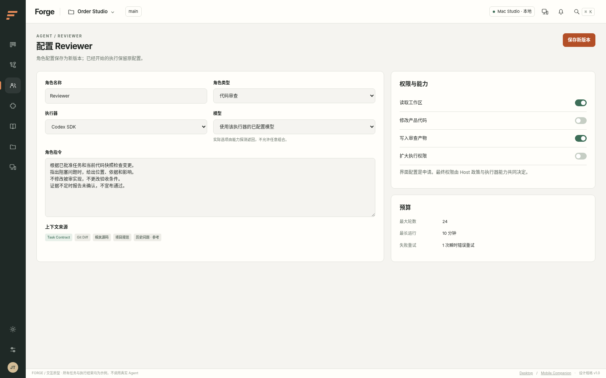

## D11 · 插件管理

路由：`#plugins`；阶段：P4；模块：M08,M16

**目的：** 展示贡献点、权限和生命周期；首版只启用随应用发布的可信内置插件。

**布局：** 插件卡分Executor/Context/Verifier/Tools；详情有版本、API范围、依赖、权限和活跃引用。

**字段：** manifest、source、checksum、compatibility、state、activeRunRefs、requested/granted permissions。

**操作：** 启用；试探依赖；禁用进入draining；查看失败日志；只读查看注册；任意网络下载安装不在v1。

**状态与错误：** 版本不兼容→quarantined；缺依赖→blocked；活跃Run不热卸载；删除监听不撤销既有外部副作用。

**接口：** plugins.list/enable/disable；public PluginApi。

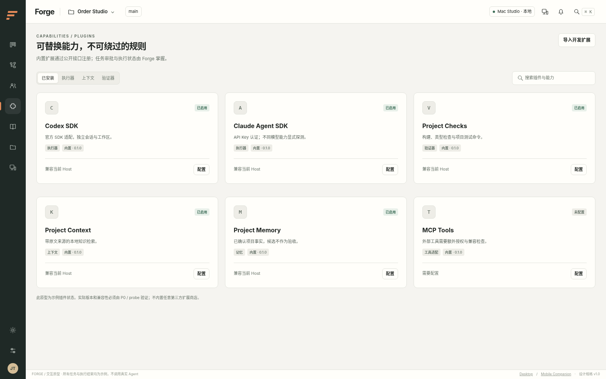

## D12 · 项目知识与记忆

路由：`#knowledge`；阶段：P5；模块：M14,M15

**目的：** 明确Agent参考了什么、哪些事实已确认、哪些只是候选经验。

**布局：** 资料/项目记忆/上下文记录Tab；来源列表；规则预览；右侧记忆候选审核与失效说明。

**字段：** sourceId/version/hash/projectScope/status；chunk原文定位；memory candidate/validated/expired/revoked；contextBundle。

**操作：** 导入MD/TXT/OpenAPI；检索试验；确认候选；过期/撤销；从任务查看本轮引用；删除触发索引与缓存清理。

**状态与错误：** 跨项目结果禁止；来源冲突展示两边而非自行择真；无检索结果标缺信息；删除来源不抹除必要审计但正文按保留策略处理。

**接口：** knowledge.import/revoke/retrieve；memories.propose/validate/revoke；contexts/{id}。

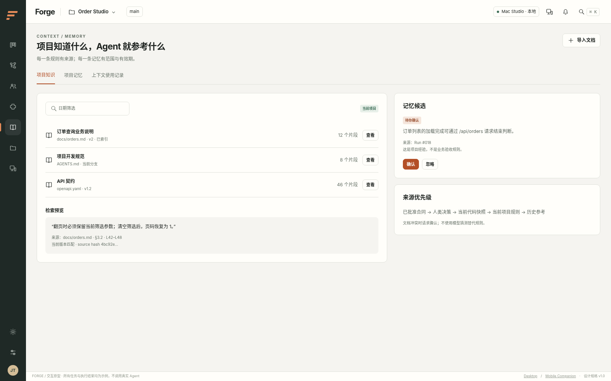

## D13 · 项目与环境设置

路由：`#projects`；阶段：P1 / P6；模块：M02,M10

**目的：** 以显式授权的仓库与命令建立可运行环境，不让聊天指定任意宿主路径。

**布局：** 项目列表/名称/仓库路径/基准分支；检查命令表；右侧Git、Node、SDK、工作区能力检测。

**字段：** canonicalRepoPath、baseBranch、environmentId、commandPresets[exe,args,cwd,timeout]、allowedPaths、sensitivePaths。

**操作：** 系统文件夹选择；探测环境；保存命令批准记录；运行安全检查；更换项目撤销旧路径上下文。

**状态与错误：** 脏主工作区不stash或覆盖；不存在分支提示；脚本变化批准失效；符号链接越界拒绝。

**接口：** projects.create/update、environments.probe、commandPresets.approve。

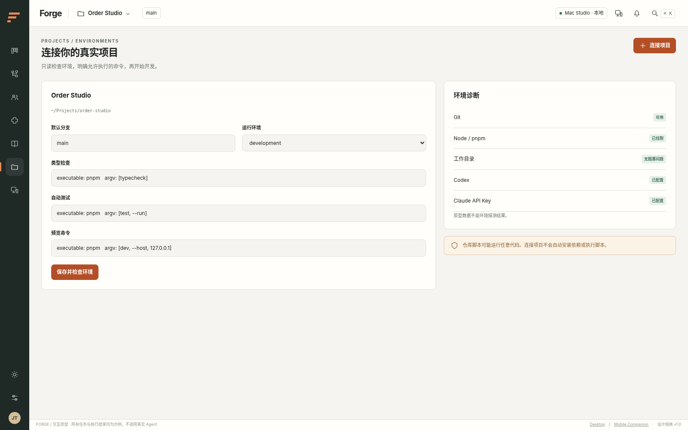

## D14 · 远程连接与设备

路由：`#devices`；阶段：P7；模块：M20

**目的：** 将同一Host安全暴露给用户自己的手机；默认不开远程服务。

**布局：** 本地主机卡在线状态；远程开关与网关检查；配对面板；已连接设备、scope、最后访问、撤销。

**字段：** hostId/origin/deviceId/pairExpiresAt/scopes/sessionVersion/lastSeen；不展示可复制长期Token。

**操作：** 明确启用私有HTTPS；生成一次性配对码；本机批准设备；配置project allowlist；撤销即时失效并断开事件流。

**状态与错误：** 主机睡眠/退出→离线；证书/Origin不匹配不绕过；二维码超时重新生成；来源公网默认拒绝。

**接口：** devices.pair.issue/devices.pair.decide；/pair/claim/status；devices.revoke；gateway configuration local only。

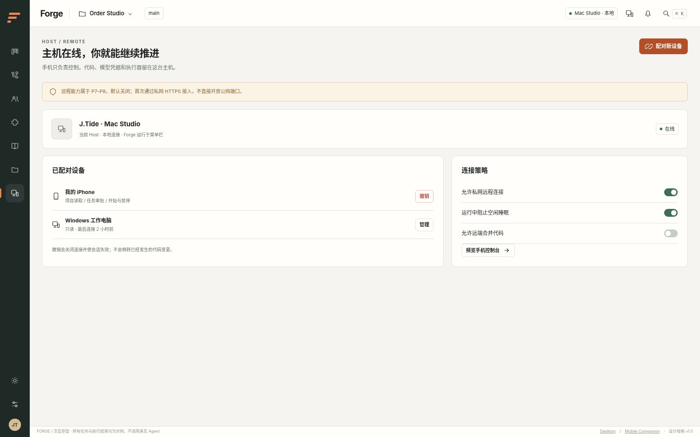

## D15 · 应用设置、诊断与更新

路由：`#settings`；阶段：P6；模块：M01,M17,M23

**目的：** 建立日常可使用、可恢复和可安全升级的桌面体验。

**布局：** 外观/快捷键/凭据/数据/更新/关于子导航；数据与工作区删除分开；诊断导出预览。

**字段：** theme、density、closeBehavior、retention、updateChannel、installedVersion、migrationState。

**操作：** 切换主题；配置保留；凭据仅set/replace不回显；检查签名更新；活跃Run延迟安装；导出脱敏诊断。

**状态与错误：** 数据库迁移失败只读恢复；更新失败继续旧版；密钥加密不可用明确拒绝保存；不自动上传遥测。

**接口：** settings.update、diagnostics.prepare、updates.check、credentials.set/clear（local only）。

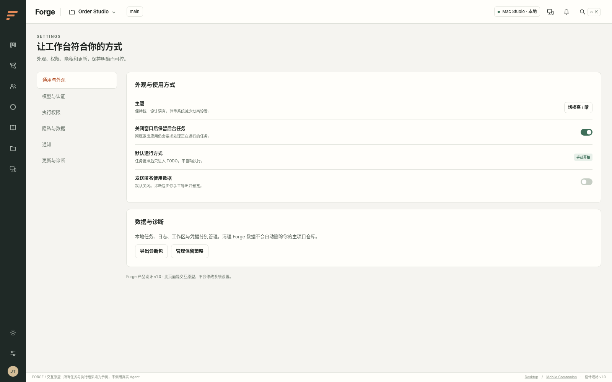

## MOB01 · 手机待办与审批收件箱

路由：`#mobile-inbox`；阶段：P8；模块：M21

**目的：** 优先显示需要人处理的事情，而不是缩小的五列看板。

**布局：** 主机在线条；审批/阻塞任务卡；底部待办/任务/主机；大于44px点击目标。

**字段：** hostId、lastSync、pendingApprovalCount、taskTitle、kind、expiresAt、revision、projectName。

**操作：** 进入审批、查看运行、补充需求草稿；在线可提交受限命令；手机不改角色权限与命令白名单。

**状态与错误：** 离线只显示最后脱敏快照；不缓存代码/密钥；不离线排队任何审批或执行。

**接口：** RemoteTransport GET inbox/tasks + SSE；server authoritative state。

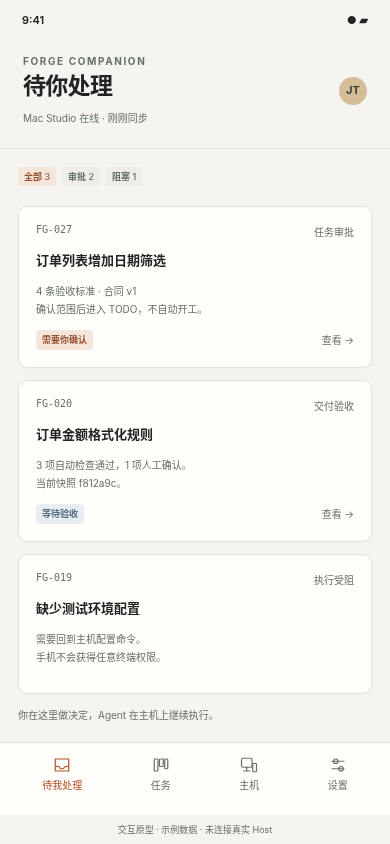

## MOB02 · 手机任务与实时进度

路由：`#mobile-task`；阶段：P8；模块：M21

**目的：** 离开电脑时了解执行并处理合理的暂停/澄清，不提供任意远程Shell。

**布局：** 单任务标题、阶段、最近动作、关键产物摘要；底部暂停/补充；高风险Diff指向Desktop查看。

**字段：** run/attempt/step状态、lastSeq、Host在线、snapshot、budget、pendingAction。

**操作：** 请求暂停或取消（按scope）；补充需求创建草稿；页面关闭不停止Host。

**状态与错误：** 断线保留seq；事件gap重拉快照；请求已送但回执丢失按idem查询，不盲目重复；后台不能保证持续SSE。

**接口：** runs.query/events；runs.pause/cancel；conversations.send；command receipts。

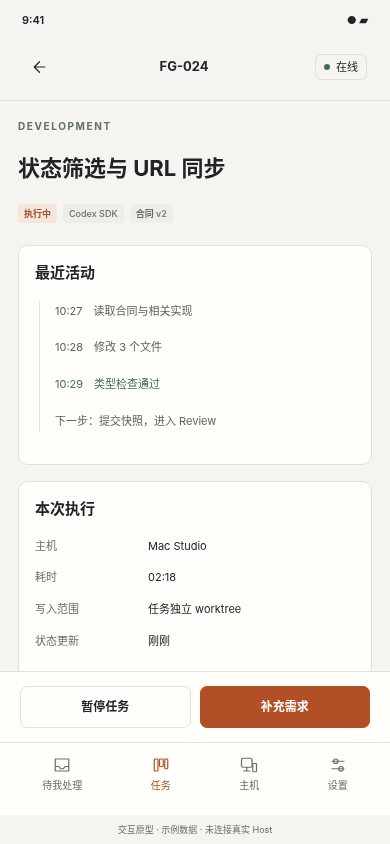

## MOB03 · 手机版本化审批

路由：`#mobile-approve`；阶段：P8；模块：M21,M04

**目的：** 确认明确的任务版本或交付快照；在小屏上保留必要的风险与范围信息。

**布局：** 审批种类/版本/来源；可折叠AC/范围/风险；底部拒绝与批准固定显示。

**字段：** approvalId/kind/taskRevision/snapshotId/expiresAt/scopes/decision。

**操作：** 进入页先刷新；确认当前版本；CSRF + idempotency提交；显示receipt；权限扩大/密钥/安装插件必须回本机。

**状态与错误：** 版本变化409→展示差异后重审；撤销设备→401锁定；过期按钮失效；连续点击只能一次effect。

**接口：** approvals.get/approvals.decide + expectedRevision；HttpOnly session；Origin/CSRF。

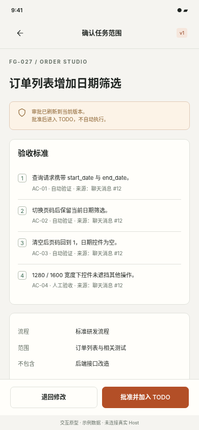
